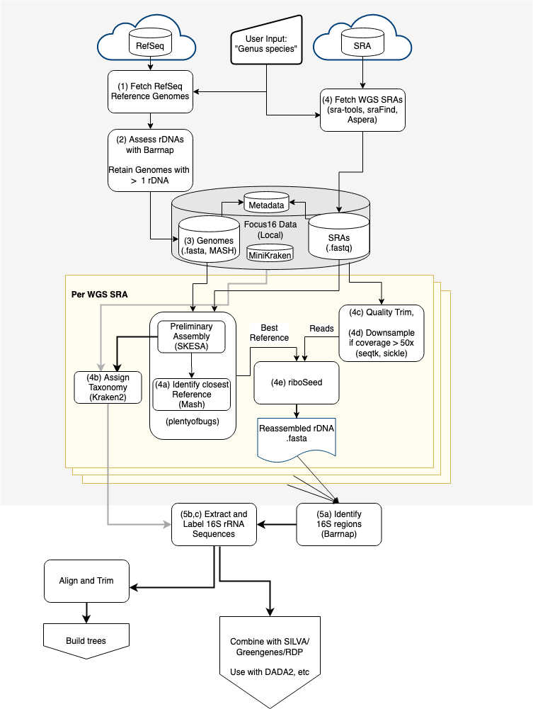

```{r setup, include=FALSE}
knitr::opts_chunk$set(echo = TRUE)
knitr::opts_chunk$set(cache=FALSE)
library(tidyverse)
library(diagram)
```


## Abstract
Current approaches to interpreting 16S rDNA amplicon data are hampered by several factors. Among these are database inaccuracy or incompleteness, sequencing inaccuracy, and biased DNA/RNA extraction. Existing 16S rDNA databases source the majority of sequences from deposited amplicon sequences, draft genomes, and complete genomes. The majority of draft genomes available are assembled from short reads. However, repeated ribosomal regions are notoriously difficult to assemble well from short reads, and as a consequence the short-read-assembled 16S rDNA region is frequently an amalgamation of the different loci within the genome. Especially when using amplicon sequence variants (ASVs) for high-resolution community analysis, assigning exact taxonomy to a given amplicon would be impossible in such a case, as even a perfectly sequenced amplicon would not be an exact match to an amalgamated 16S rDNA sequence in the database. We present focusDB, a pipeline for improving 16S rDNA databases by mining NCBI's Sequence Read Archive for underexploited whole-genome sequencing runs. Using riboSeed (a genome assembly tool for correcting rDNA misassembly), focusDB allows for large-scale curation of 16S rDNA databases. When applied to four datasets, we show an average increase of 60% in the number of unique sequences for given species. Assigning taxonomy using this augmented SILVA database resulted in more annotated ASVs . Further, fine-scale classification improved by revealing ambiguities at the genus or species level for ASVs that would otherwise have been exclusively (and incorrectly) classified as one particular taxa. 

Here, we show that improvements can be gained for a number of genera, and invite the community to expand our work to augment existing 16S rDNA databases such as SILVA, GreenGenes, and RDP.

## Introduction
The use of genetic markers for microbial classification has seen explosive growth over the past decade [@liu2012popular].The 16S rDNA gene is the standard utilised in the assessment of prokaryotic community composition by amplicon sequencing. 16S rDNA has been used for community analysis in diverse environments such as the gut microbiota of cattle and pigs [@avila2018prediction], soil [@santamaria2018soil], marine environments [@dang2000bacterial], and the gut[@jovel_characterization_2016]. The rDNA regions are highly conserved between species but maintain enough diversity that organisms can be differentiated at the genus level [@woo2008then], whilst also maintaining enough conservation to distinguish at the Domain level [@woese1990towards]. 


Organisms have been observed to contain  up to 21 copies of the rDNA operon[@vetrovsky_variability_2013;stoddard_rrndb_2015;@acinas2004divergence], and there may be variability between each 16S rDNA copy [@sun2013intragenomic].  This can negatively impact  16S rRNA classification. The degree of nucleotide identity  between rDNA copies varies by taxa. Extremophiles have been reported to possess high 16S rDNA copy heterogeneity, between 2.4% and 9.3% sequence variation between copies in  several species [@sun2013intragenomic].  Although these repeats complicate genome assembly, each instance of the 16S rRNA contains valuable information; an ideal amplicon analysis framework would be able to  both correct for copy number variation between organisms in a community, and also know which set of 16S rRNA variants might belong to a particular organism. 


The three most popular  16S rDNA databases for bacteria and archaea are Greengenes [@desantis2006greengenes], SILVA [@quast2012silva], and the Ribosomal Database Project (RDP) [@cole2005ribosomal] each contain 16S rRNA sequences derived from multiple major international nucleotide sequence databases, principally EMBL/ DDBJ and Genbank.  The databases differ in their approach to  sequence classification. The RDP database uses the RDP classifier to assign taxonomic to 16S rRNA sequences [@wang2007naive]. SILVA and Greengenes inherit a sequence's taxonomic assignment from the source database(such as NCBI or EBI).. SILVA provides a non-redundant database version in which no two sequences share more than 99% sequence identity at a given taxonomic level[@quast2012silva]. Although each database performs sequence quality checks, only Greengenes actively checks for chimeric sequences, which can negatively affect 16S taxonomic assignment if present in a reference database [@desantis2006greengenes]. 


The National Centre for Biotechnology Information (NCBI) provides multiple databases, including the Sequence Read Archive (SRA) [@kodama2011sequence] for raw  high-throughput sequencing data, the Genome database as an umbrella for draft and complete genomes.  However, not all genome sequences in the NCBI Genome database have publicly available raw data  in the SRA, and only  10% of genomes are closed or complete [@waters2018riboseed]. A common weakness of draft assemblies from short-read sequencing is incorrect assembly of repeated rDNA regions of a genome, which may be collapsed/merged into a single rDNA (and the 16S rRNA  will in turn be incorporated into SILVA, GreenGenes, or RDP). 


A survey of the SILVA 132 database shows that 9.5% of sequences come from draft genome assemblies; the vast majority (87%) consist of amplicon sequences (usually Sanger sequenced), and the remaining 2% come from complete genomes. Illumina-sequenced genome assemblies are prone to errors in rDNA regions, as the length of the region exceeds read lengths. PCR spanning the rDNA region, followed by Sanger sequencing, or the use of long-read technologies such as PacBio or Nanopore sequencing, can resolve these multiple copies but, as the majority of the data generated over the last two decades comes from short read sequences [@land2015insights], fixing these collapsed regions remains a valuable goal.  


The correct reassembly of multiple rDNA regions of draft genomes can be achieved using riboSeed, which uses a reference genome to help assemble the rDNA regions of a draft genome [waters2018riboseed]. riboSeed exploits the observation that the flanking regions of the rDNA region are highly conserved within a taxon, yet variable between rDNA copies in the same genome. 

We developed focusDB to augment existing 16S rRNA databases by mining the SRA database for candidate whole-genome sequencing studies for reassembly. Incorporating these reassembled sequences improves fine-scale taxonomic classification, aiding researchers efforts to understand microbial communities.


## Methods
### The FocusDB Pipeline

focusDB is a pipeline to identify, download, and reassemble whole-genome-sequencing projects from NCBI's SRA using riboSeed to improve 16S rDNA assembly,  and thereby augment existing 16S rRNA databases (such as SILVA, Greengenes, RDP) to enhance taxonomic classification. 

focusDB can be installed via pip into a conda environment, for ease and reproducibility.

The focusDB pipeline is shown as a flowchart (Figure \@ref(fig:flowchart)). Details of third-party tools used in focusDB can be found in supplementary information.

Given a genus or "Genus species" binomial, focusDB progresses as follows:

1.  Potential complete reference genomes are identified and downloaded from Refseq by matching the provided organism name (this may also be restricted to genomes defined by the user). 
2. Barrnap [@seemann_barrnap_2020]  is used to screen these complete genomes by estimating the 16S rRNA count. 
3. Reference genomes with a single 16S rRNA are discarded. This catches two cases: 

    a. an organism only has a single 16S rRNA. In this case riboSeed assembly will not improve on existing draft genomes.,, 
    b.  a draft genome may have been incorrectly attributed the classification of "complete".  Errant reference genomes are therefore discarded, and the remaining references are available for use in the pipeline. 

4. A Mash[@ondov_mash_2016a] sketch is generated from the remaining references.
5. sraFind ^[https://github.com/nickp60/sraFind] is used to identify all whole-genome sequencing SRA accessions for the organism of interest. All of these are downloaded with fast(er)q-dump [@sra-tools_2019]. Steps 5a-5e proceed for each SRA.

    a. **Identify closest reference genome**. For a given SRA, the most compatible reference genome is determined via plentyofbugs, which performs an initial assembly with the fast and highly-accurate assembler SKESA [@souvorov_skesa_2018] using a subsample of the dataset. Mash is used to identify the closest match between the preliminary assembly and all the reference genomes from step 1. If no close match above a user-defined threshold (defaulting to a Mash distance of 0.1, roughly corresponding to a within-genus match[@ondov_mash_2016a]), the SRA is skipped; otherwise, the closest match is  later used for a reference with riboSeed. 
    b. **Assign Taxonomy**. Kraken2[@woodKrakenUltrafastMetagenomic2014] is used to assign taxonomy to the preliminary SKESA assembly. The highest-ranked binomial name is recorded, and the full kraken report is stored in the output folder for inspection.  
    c. **Pre-Assembly Quality Control**. Reads are run through several quality control steps. The average length of the reads is checked based on the first 1000 reads. An SRA that contains reads of very low length (<65bp) will be rejected, as very short reads cannot be used effectively by riboSeed to differentiate rDNA flanking regions. Reads are then quality trimmed with sickle using default parameters. fastp is used to identify and remove any remaining adapter sequences. For paired-end runs, unpaired reads are rejected.  
    d. **Downsample**. Read coverage is assessed using a provided estimate of genome length, or the length of the reference genome. If read coverage exceeds a user-specified threshold (for an explanation of the default 50x coverage, see SPAdes paper [@bankevichSPAdesNewGenome2012]), trimmed reads are down-sampled to reach the desired coverage with seqtk [@li_seqtk_2020].
    e.  **De fere novo Assembly**. The SRA reads are then assembled using riboSeed, using the reference genome determined in (2a) as a template genome. Subassemblies are performed with SPAdes[@bankevichSPAdesNewGenome2012]; the default parameters of 3 rounds of seeding and 1kbp flanking regions are used.
    
6.  16S rDNA sequences are extracted from either the subassemblies ("fast" mode) or from the final assembly ("full" mode) using barrnap, marked with the taxonomy classified by Kraken2, and written to a fasta file that matches the format used by the SILVA database. The taxonomy, run statistics, and other diagnostic information is recorded in tabular files. If an aspect of the pipeline fails, rerunning the same command will reuse available intermediate results wherever appropriate. 


In our analysis, we removed any 16S rRNA under 1358bp (under the 1st quartile of the sequence lengths in SILVA, and removed any 16S rRNA for which Kraken2's taxonomic  assignment showed less than a 70% majority of sequences were assigned at the genus level.  Sequences from an additional SRA were removed due to contamination (see supplementary data).


```{r flowchart, echo=FALSE, fig.cap="Flowchart of the focusDB pipeline. Gray lines refer to taxonomic information, and black lines refer to sequence information.", out.width = '80%'}

```

### Selecting suitable test datasets and identifying genera

Three mock communities described in the DADA2 manuscript [@callahanDADA2HighresolutionSample2016] were selected to assess the utility of focusDB.  These communities, named "Extremes", "HMP", and "Balanced", and comprising 27, 21, and 57 members respectively, were sequenced on an Illumina MiSeq yielding over 500,000 250bp paired-end reads. To provide an assessment of of real-world usage of focusDB, we used the data generated in the EndoBiota study[@ataEndobiotaStudyComparison2019]^[PRJEB26800]. 

As focusDB takes a genus or binomial name as input, we first identified the genera present in each dataset. In the three mock communities, genera were identified from manuscripts of their respective studies. To identify which genera to process with focusDB for the EndoBiota study, a preliminary assessment was performed with DADA2, assigning taxonomy with the DADA2-formatted subset of SILVA 132 <see microbiome.Rmd, section "Preliminary taxa assignment for EndoBiota study"> (https://zenodo.org/record/1172783).  This resulted in the identification of 333 genera combined across the four datasets. When cross-referenced with sraFind and RefSeq, this list was filtered down to the 85 genera that had both short-read SRAs available and at least one reference genome for that genus (Figure \@ref(fig:datasets)).

```{r datasets, echo=FALSE, fig.cap="SUPPLEMENTARY. Of the 333 unique genera across the 4 datasets, 85 had public short-read data in the SRA and at least one Refesq complete genome available. <TABLE S2>.  While only a fraction of the SRAs meet the requirements for reassembly, future data availability will allow us to revisit previously excluded SRAs", out.width = '80%'}
knitr::include_graphics("figures/S6-datasets-log.png")
```

### SUPPLEMENTARY METHOD 1: Assembly mode parameter choice
As candidate 16S rRNA sequences could be identified from both riboSeed's subassemblies and the final *de fere novo* assembly, we identified which SRAs in our dataset had completed genomes, and performed an analysis comparing complete genomes to the sequences recovered from "fast" mode (sequences from riboSeed's subassemblies) and "full" mode (sequences from riboSeed's final *de fere novo* assembly). This showed that the subassemblies have fewer errors (Figure @ref(fig:rdnamodes)), and as such are the ones we report below and recommend for augmenting a database (see supplementary data section "assess_assembly_snps"). Job-handling parameters and run scripts are available in supplementary data. 
 
```{r rdnamodes, echo=FALSE, fig.cap="SUPPLEMENTARY. Comparing assembly modes for accuracy. SRAs in our dataset that underwent genome completion were used to identify the most accurate method of 16S rRNA sequence assembly. De novo assembly resulted in highly accurate 16S rRNA sequences, but was only able to recover 66 sequences. '--fast' mode proved to be the best tradeoff of accuracy and efficiency.", out.width = '80%'}
knitr::include_graphics("figures/S5-set-accuracy.png")
```


### Running FocusDB
FocusDB was run in a conda environment with the required dependencies <see supplementary material repository>. For each of the 85 genera, up to 200 reference genomes were used (depending on the number of reference genomes available) and limited the scope of the analysis to a maximum of 50 randomly selected SRAs for computational reasons. A minimum Mash distance was set to 0.1 [@ondov_mash_2016a] between a preliminary assembly and a reference genome, as this was shown to be the maximum distance between the reference and sequenced isolate that riboSeed performs well with (see @waters2018riboseed Figure 5). 

### Benchmarking Reassembled 16S rRNA against Complete Genome 16S rRNA sequences

sraFind  was used to identify SRA accessions that corresponded to complete NCBI genomes. For the genera considered in this study, these were matched with SILVA sequences sourced from complete genomes (see supplementary data "Provenance of strains"). Pairwise alignments were generated between the riboSeed 16S rRNA sequences and the SILVA sequences using the Biostrings package[@pages_biostrings_2020] in "overlap" mode (ie a global alignment with free ends) with a simple scoring matrix  ( matches=1,  mismatches =0 ); the highest-scoring best alignment for a given reference 16S rRNA was used to count mismatches identify misassemblies. Alignments shorter than 1400bp were rejected.

### Assessing taxonomic assignment
We used the DADA2 pipeline to assign taxonomy after processing the reads as described in their respective papers. All scripts can be found in supplementary data. We assigned taxonomy with the naive Bayesian classifier implemented in DADA2. This classified at the genus level, and DADA2's "assignSpecies" command was used to assign species-level taxonomy; we enabled the "allowMultiple" parameter to view ambiguities in the assignment.

 
## Results

### 1. Benchmarking Reassembly Accuracy 
riboSeed has been shown to generate high-quality reconstructions of each rDNA region when benchmarked against hybrid assemblies[@waters2018riboseed]. Using sraFind, we identified which sequences in SILVA originated from closed, complete genomes; these were used to benchmark the accuracy of the 16S rRNA sequences reassembled with the focusDB pipeline. In our dataset, 69 SRA/complete genome pairs met that criteria. 

Comparing the re-assembled 16S rRNA sequences to the 16S rRNA sequences from complete genomes shows a low error rate (Figure \@ref(fig:accuracy)). This confirms that focusDB's best-case accuracy is comparable to long-read/hybrid assembly, and that focusDB sequences can be used to augment existing databases.

 ```{r accuracy, echo=FALSE, fig.cap="Assembly errors per Kbp were calculated between each focusDB sequence to the reference genome. Grey bar represents sequences with no assembly errors.", out.width = '80%'}
knitr::include_graphics("figures/S5-set-accuracy.png")
```
### 2. Comparing reassembled 16S rRNA to draft 16S rRNA
As repeated rDNA operons are difficult to resolve with short read sequences, draft genome assemblies can (and often do) contain a single assembled rDNA region with elevated read coverage. This can be problematic for genus or 16S rRNA classification as– the 16S rRNA recovered may not just correspond to one of $n$ 16S rRNAs, but it can be a consensus "summary"/"collapsed" 16S rRNA resulting from imperfect assembly of the repeated region. In the supplementary data, we show a few examples of such cases.

### 3. Augmenting SILVA with results from focusDB
#### Recovering sequences from reassembly
focusDB was used to build an improved database for the three mock datasets described in the DADA2 paper and a real-world dataset from the Endobiota Study (insert reference here). From the 85 genera considered, focusDB processed 2387 SRAs (Figure \@ref(fig:sras)), and recovered sequences from 1397 SRAs. Several factors can contribute to failing to recover 16S rRNA sequences from a given SRA; among these are a too-distant reference genome, low rDNA flanking diversity, low read length, or high read error rates. In total, we recovered 5854 16S rRNA sequences, of which 3008 were unique. 

```{r sras, echo=FALSE, fig.cap="SRAs available from datasets available.", out.width = '80%'}
knitr::include_graphics("figures/2-genera.png")
```


#### Improving database diversity
Ideally, focusDB would be applied to every eligible SRA currently available, and periodically rerun as more high-quality reference genomes are generated with long-read techonologies; As we do not have the resources to do this, we assessed the diversity increase gained by augmenting SILVA with the 85 genera considered in this study. For thoroughly-sequenced genera such as *Escherichia*, *Pseudomonas*, or *Bacillus*, the gains are small. However, other taxa showed marked increases in the genus-level diversity (Figure \@ref(fig:reassembly)). 


 ```{r reassembly, echo=FALSE, fig.cap="Green circles indicate SRAs that yielded 16S rRNA sequences, while blue diamonds indicate SRAs failing to yield reassembled 16S rRNA sequences. Pink triangles show SRAs that were rejected due to limitations in the diversity of available reference genomes, and inverted green triangles show SRAs rejected due to read length, insufficient coverage, poor read quality, etc. A few errors occurred, usually when the SRAs metadata conflicted with the associated sequencing data and caused download errors or errors from reads with incorrect pairing.", out.width = '80%'}
knitr::include_graphics("figures/2-genera.png")
```


### 4 Assessing Taxonomic Assignment 
DADA2 was used to identify ASVs from the 4 datasets, resulting in a total of 4098 ASVs (109 sequences from the "HMP" dataset, 26 from the "Extreme" dataset, 94 from the "balanced" dataset, and the rest from the EndoBiota study). We then compared the taxonomic results of classification using either the SILVA 132 or SILVA 132 augmented with the focusDB. Of the 4098 sequences, focusDB improved the assignment of 20 strains [suppl. STABLE_different_assignment.tab]. Improvement could happen in two ways: a previously un-classified ASV gained classification, or previously-assigned ASV gained more species- (or genus-) level details. In our dataset, three unclassified strains gained annotations. The remaining 25 had more detail added to the genus or species level; usually, this meant that with SILVA along, a single species classification was given, but with the augmented database, it was revealed that the ASV could belong to more than one or more other organisms.

```{r diversity, echo=FALSE, fig.cap="Increasing the genus-level diversity of the SILVA database by augmenting with focusDB.", out.width = '80%'}
knitr::include_graphics("figures/3-perc_unique_genus.png")
```


Discussion
focusDB orchestrates the reassembly of whole-genome sequencing datasets in SRA to recover 16S rRNA sequences that may be missing from the existing reference databases. Using the riboSeed, FocusDB reassembles draft genomes that currently contribute a single (often collapsed) 16S rRNA to resolve distinct instances of the 16S rRNA operon. We show that this increases the sequence diversity of the 16S rRNA databases, and that the increased diversity results in measurable improvements to taxonomic assignment.

focusDB improved fine-scale taxonomic assignment in two ways: by assigning previously unclassified sequences, and by revealing "overeager" species assignment when a 16S rDNA sequence could have come from two or more species. Based on the improvements gained with the 85 genera considered here, we believe a wide-scale application of focusDB could have great benefit.


The third limitation is the availability of high-quality closed genomes to use as references. With the increased adoption of long read technologies, we envisage that this limitation will decrease with time; indeed, a point will come when focusDB will no longer be needed.

Further limitations exist within focusDB and within riboSeed. The success of riboSeed's *de fere novo* assembly hinges on the similarity of the reference to the sequenced isolate, the differentiating power of the rDNA flanking regions, read length, and other factors. The vast majority of short-read sequencing is performed with single-end or paired-end libraries; currently riboSeed does not support less popular strategies such as mate-paired libraries. As the difficulty of genome completion decreases with the use of long read sequencing, this limitation will diminish. 

Despite these limitations, we have shown that focusDB can contribute towards better molecular ecology anaalysis. Using focusDB to augment existing databases (such as NCBI's 16S RefSeq Microbial database, SILVA, RDP, and GreenGenes) will give researchers more clarity and confidence in low-level taxonomic assignment, which in turn will lend new insights into the inner workings of complex communities. 

# References
