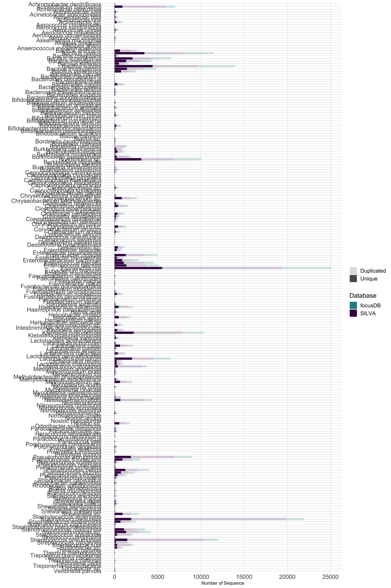

```{r setup, include=FALSE}
knitr::opts_chunk$set(echo = TRUE)
knitr::opts_chunk$set(cache=FALSE)
library(tidyverse)
library(diagram)
```
## Abstract
Current approaches to interpreting 16S rDNA amplicon data are hampered by several factors, among these are database inaccuracy/incompleteness, sequencing inaccuracy, biased DNA/RNA extraction, and more. The limitation of database accuracy stems from where the sequences are sourced: namely, from draft genomes. Ribosomal regions are notoriously difficult to assemble well due to their repeated regions, and as such, the 16S rDNA region assembled is frequently an amalgamation of the different loci within the genome. Especially when using Amplicon Sequence Variants for high-resolution community analysis, assigning exact taxonomy to a given amplicon would be impossible in such a case, as even a perfectly sequenced amplicon would not be an exact match to an amalgamated 16s sequence in the database. Here, we present focusDB, a pipeline for improving 16S rDNA databases by mining the SRA for under-exploited whole-genome sequencing runs. Using riboSeed (a genome assembly tool for correcting rDNA miss-assembly), focusDB allows for high-throughput curation of 16S rDNA databases. We show the improvements that can be gained for a number of species, and invite the community for the opportunity to expand our work to existing resources such as SILVA, GreenGenes, and RDP.

## Introduction
The 16S rDNA gene is the standard in amplicon sequencing of community analysis, and such is a testament to the success of this gene as a universal indicator of microbial diversity [@klindworth2013evaluation]. 16S rDNA has proven effectiveness in community analysis in environments such as the gut microbiota of cattle and pigs [@avila2018prediction], soil [@santamaria2018soil] and marine environments [@dang2000bacterial]. The rDNA regions are highly conserved between species however maintain enough diversity that organisms can be differentiated at the genus level with great accuracy [@woo2008then], whilst also maintaining enough conservation to distinguish at the Domain level [@woese1990towards]. Prokaryotes contain up to 21 rDNA operons, with approximately 40% of prokaryotes containing 1 or 2 copies of the rDNA region [@acinas2004divergence]. Although there are usually multiple copies of the rDNA operon, there still lies variability between each rDNA region within a single genome.
 
Intragenomic heterogeneity for the 16S rDNA region has been reported to occur between copies, with nucleotide identity varying between species, and extremophiles being reported to possess high 16S rDNA copy heterogeneity [@sun2013intragenomic, @crosby2003understanding]. While tools such as CopyRighter can correct copy number for those organisms with available data, the limitations of the databases prevent widespread usage. Additionally, current 16S rDNA amplicon analysis pipelines do not correct for copy heterogeneity. This draws emphasis on the inclusion of each rDNA copy during assembly and when analysing community abundance.
 
There are three main 16S rDNA databases for bacteria and archaea: Greengenes [@desantis2006greengenes], SILVA [@quast2012silva] and the Ribosomal Database Project (RDP) [@cole2003ribosomal]. RDP and SILVA focus on maintaining as much diversity as possible, whilst SILVA also contains a non-redundant database, where duplicate sequences are removed. Greengenes focuses on removing chimeric sequences. The source of the 16S rDNA sequences for Greengenes is GenBank [@desantis2006greengenes], a nucleotide sequence database. RDP sources 16S rDNA data from multiple major international nucleotide sequence databases (EMBL/ GenBank/ DDBJ) [@cole2003ribosomal] and SILVA obtains rDNA sequences from a collection of sources, including GenBank and EMBL [@quast2012silva]. The National Centre for Biotechnology Information (NCBI) is a public database that contains full genome and nucleotide sequences, taken from various sources, including GenBank. NCBI was used in this project as a source of draft genomes, due to the public availability aspect of the NCBI draft genome database, the Sequence Read Archive (SRA) [@kodama2011sequence]. Not all sequences available on the NCBI genome database are publicly available. The genome database consists of complete genomes and draft genomes. Only 10% of genomes on the genome database are closed or complete [@waters2018riboseed], leaving the remaining 90% as draft genomes. A common weakness of draft assemblies is incorrect assembly of the repeated rDNA region of the genome, which often get collapsed/merged into a single rRNA (which in turn may end up in SILVA, GreenGenes, or RDP).
 
The popularity of short-read sequencing platforms has driven the issue of incorrect assembly of 16S rDNA in species containing multiple copies of the gene. The vast majority of sequences deposited on the SILVA database is from amplicon sequencing and thus the assembly of any species with multiple rDNA operon copies by short-read sequencers is likely incomplete. A survey of the Silva 132 database shows that 9.5% of sequences come from draft genome assemblies;  the  vast majority (87%) consist of amplicon sequences (usually Sanger sequenced, etc), and the remaining 2% come from complete genomes.  

As Illumina-sequenced 16S rDNA regions are prone to errors in assembly, as the length of the repeated operon exceeds the read length of the sequencer. Sanger sequencing or the use of long-read technologies such as PacBio or Nanopore sequencing can resolve these repeats, but as the majority of the data generated over the last two decades comes from short read sequences, fixing these collapsed regions remains a valuable goal.

The correct reassembly of multiple rDNA regions of draft genomes is done so by riboSeed, which uses a reference genome to correctly assemble a genome, with specific emphasis on the rDNA regions [@waters2018riboseed]. The flanking regions of the rDNA region is highly conserved between species yet variable between rDNA copies in the same genome. The unique flanking regions of the rDNA operon are exploited by riboSeed mapping the genome against a reference genome, correctly identifying and constructing each rDNA region. The reference genome being the most similar sequence to the available on RefSeq.

In order to maximize the information gained from 16s amplicon sequencing experiments, we developed focusDB: a pipeline to improve existing 16S rDNA databases through mining the SRA for candidates for reassembly. The use of focusDB cannot correct existing amplicon sequencing efforts, however the number and improvement of 16S rDNA sequences for taxonomic reference can be improved with focusDB, through the reassembly of draft genomes and extraction of 16S rDNA sequences.
 
## Methods
focusDB is a pipeline to download draft genome SRAs for a species, reassemble, and extract the 16S rDNA sequences from each draft genome for use in a curated 16s database. These 16S sequences can then be used, in addition to pre-existing 16S sequences, to enhance taxonomic classification through the increased number of 16S rDNA sequences.

focusDB can be installed via pip into a conda environment, for maximum reproducibility.

### 
focusDB requires certain required arguments to function, with a number of optional arguments to suit the users’ needs. Required arguments include: query species, output directory, reference genomes output directory and strain number. An input of the six aforementioned arguments leads to base functionality of the pipeline. Optional arguments can be used to increase suitability, such as specification of CPU and RAM capabilities of the system used.
The focusDB pipeline is shown as a flowchart (Fig. 1). Further details on all software used in focusDB can be found in supplementary information.

1) `plentyofbugs` is used to download all (or a user-defined subsample) of potential reference genomes from Refseq.  The amount of ribosomal RNA operons present in the reference genome is assessed with barrnap, a program capable of locating and returning the coordinates of ribosomal features. This step is to evaluate the highest possible number of 16S sequences that can be assembled for the current SRA.
2)  `sraFind` is used to identify whole-genome sequencing SRA accessions for the organism of interest.  All of these are downloaded with fasterq-dump[cite].
The following process occurs in a loop for each SRA:
3)   Reads are run through several quality control steps. This  will reject SRAs where reads are too short to be effectively used with riboSeed  (<65bp)The average length of the reads is checked based on the first 30 reads. This is to prevent further processing of an SRA that contains reads of very low length (<65bp). As riboSeed cannot assemble genomes with reads of this length. Reads are then trimmed with `sickle`.
4)   Read coverage is assessed using a user-inputted genome length if given, or the length of the reference genome if not. If read coverage exceeds a user-specified threshold (default 50X, see SPAdes paper), reads are down-sampled to reach the desired coverage.
5)  The best reference genome is determined via `plentyofbugs`. In short, given reads and set of potential reference genomes, `plentyofbugs` uses Mash distances to quickly determine the closest reference to a preliminary assembly generated with SKESA.
6) The SRA reads are then assembled using riboSeed, which uses the reference genome from 4) as a template genome.
7) 16S rDNA sequences are extracted from the assembled genome using barrnap and concatenated to a single file, where all 16S sequences from all SRAs for the query species are stored.

focusDB also includes some utility tools to use the sequences with 16s amplicon analysis pipelines.

- (combine-focusdb-and-SILVA) Combine sequences for a given organism from focusdb results and Silva database
- (align-and-trim-focusdb) For pipelines requiring aligned sequences, generate alignment and trim with `mafft` and `TrimAl`, respectively

 ```{r flowchart, echo=FALSE, fig.cap="", out.width = '80%'}
knitr::include_graphics("figures/1-flowchart.png")
```
Fig 1. Flowchart demonstrating the process of focusDB. Programs called upon are beside their corresponding box. The numbers correlate to the processes described in [focusDB overview].
 
## Results

### DADA2 Extreme dataset: a case study
In order to showcase focusDB, a dataset was chosen to suitably demonstrate the effect that focusDB had on the taxonomic classification. The data set chosen was taken from the DADA2 pipeline paper [REF]. DADA2 is an amplicon analysis pipeline used specifically for high-resolution Illumina data. The DADA2 paper generated three mock communities to test their pipeline; balanced, HMP and extreme with 57, 21 and 27 members respectively. Each community had varying levels of diversity in the form of nucleotide similarity between species, with the extreme dataset containing strains that were differentiated by as little as a single nucleotide. Each of the three mock communities were sequenced at a depth of 500,000 Illumina MiSeq paired-end reads 2x250bp. The extreme dataset was obtained from NCBI using the accession SRX1478507 (http://www.ncbi.nlm.nih.gov/sra/SRX1478507) and run through the DADA2 1.12.1 pipeline.
The R script used for the DADA2 pipeline is available in the supplementary information.

In the DADA2 tutorial, they recover XX ASVs; our hands with version 1.12.1, we recovered 34 ASVs.  Using table X from the DADA2 paper, we ran focusDB on each of the 27 species listed, also including  _Anaerocolumna xylanovorans_, an updated name for _Clostridium xylanovorans_.


Of the 27 organisms in the Extreme dataset, 16 had publicly available WGS data in the SRA database. Others were excluded as no reference genomes were available for reassembly. From those remaining, focusDB successfully recovered potentially novel 16S sequences from 6 strains.

 ```{r srafig, echo=FALSE, fig.cap="Strains with whole genome seqeuncing SRAs available", out.width = '100%'}
knitr::include_graphics("figures/2-success.png")
```
Figure 2: Strains with whole genome sequencing SRAs available.  Shape indicates that status of the reassembly for a given SRA; color indicates the status of the focusDB run for a given organism.


### Assessing the database Diversity
Ideally focusDB would be applied to every eligible SRA currently available; we do not have the resources to do this. In order to show what data yields could be expected, we assessed characteristics of species-specific databases for the eligible organisms in the Extremes dataset.

Table 1: Unique sequences for which focusDB could recovered 16S sequences from re-assembled draft genomes

| Genus           | Species          | SRAs Used    | SRAs Pass QC | focusDB | SILVA | focusDB + SILVA |
|-----------------|------------------|----------|-----------|---------|-------|-----------------|
| Bacteroides     | cellulosilyticus | 3        | 2         | 7       | 14    | 21       |
| Bacteroides     | fragilis         | 20**     | 18        | 152     | 229   | 381      |
| Bacteroides     | ovatus           | 12       | 7         | 29      | 51    | 80       |
| Bacteroides     | thetaiotaomicron | 14       | 9         | 36      | 65    | 101      |
| Bacteroides     | vulgatus         | 14       | 10        | 41      | 52    | 93       |
| Bacteroides     | uniformis        | 15       | 13        | 29      | 43    | 72       |
| Parabacteroides | distasonis       | 18       | 9         | 30      | 65    | 95       |

** 112 total _B. fragilis_ SRAs were available; we limited our scope to 20 for computational purposes.

<!-- NOTE: generate table with https://www.tablesgenerator.com/markdown_tables -->


 ```{r uniquefig, echo=FALSE, fig.cap="Sequences", out.width = '100%'}

```


### Comparing reassembled 16S to Complete genome 16S

As repeated rDNA operons are difficult to assembly, Draft genome rDNA can (and often do) contain a single rDNA.  This is problematic for species identification -- the rDNA recovered is not just one of /n/ rDNAs, but it can be a consensus "summary"/"collapsed" rDNA resulting from imperfect assembly of the repeated region. 

riboSeed has been show to generate high-quality reconstructions of each rDNA when benchmarked against hybrid assemblies. Here, we compare the 16s sequences from focusDB/riboSeed reassembly of genomes to those sequences from SILVA that originated from complete genomes. In our dataset, 4 strains met that criteria; 2 were assembled  from  PacBio (and were therefore not reassembled with focusDB). Table 2 shows the results of comparing the reassembly to the complete genome; in both cases, all 5 16S rDNAs were 100% matches over their full length (after aligning and trimming alignment  bp at the 3' and 5'ends). This confirms that the best-case accuracy of riboSeed is comparable to long-read/hybrid assembly.

Table 2: reassembling complete genomes with riboSeed

|  Organism                    | Assembly      | Technology| Identical |
|------------------------------|---------------|-----------|-----------|
| Bacteroides cellulosilyticus |GCF_001318345.1| PacBio    |    -      |
| Bacteroides ovatus           |GCF_001314995.1| Illumina  |   5/5     |
| Bacteroides thetaiotaomicron |GCF_001314975.1| PacBio    |   5/5     |
| Bacteroides vulgatus         |GCF_001412315.1| PacBio    |    -      |

### Comparing reassembled 16S to Draft 16S

For the 7 organisms, we identified which of SILVA sequences originated from which assemblies, and assessed their levels of completeness. We determined whether the rDNAs assembled with riboSeed matched any of the rDNAs in the  database for that particular strain. In some cases (such as _B. ovatus_ GCF_900107475.1), the single rDNA in SILVA was recovered with focusDB; in others (such as  _B. ovatus_ GCF_000699665.1) the identical sequence was not recovered, whether due to severely truncated sequences in SILVA or SNPs. Alignments can all be found in the supplementary repository.


### Species Assignment of DADA2's Extremes ASVs

Not sure if we actually care about this section.


## Discussion

focusDB orchestrates the reassembly of whole-genome sequencing datasets in SRA to recover rDNA sequences that may not be missing from the existing databases. Using the _de fere novo_ assembly tool riboSeed, draft genomes that currently contribute a single (often collapsed rDNA) can be reassembled to resolve instances of the rDNA operon. We show that this increases the sequence diversity of the sequence databases. 

There are three main limitations facing the large-scale application of focusDB:  The first is the computational power required to reassemble the $\approx$ 94,000  SRAs (as of summer 2019) that were used to generate draft genomes. This is ignoring the $\approx$ 119,000 Draft genomes for which no reads were ever released, which leads to the second limitation: data availability. Releasing draft genomes without the reads used to generate them hampers efforts such as this one to expand on the purpose of the original study.  

The third limitation is the availability of high-quality closed genomes to use as references. With the increased adoption of long read technologies, this limitation will decrease with time.

Further limitations exist within focusDB and within riboSeed. The success of riboSeed's _de fere novo_ assembly hinges on the similarity of the reference to the sequenced isolate (and the differentiating power of the  rDNA flanking regions).  As mentioned above, as the difficulty of genome completion is decreases with the use of long read sequencing, this limitation will be decreased. The vast majority of short-read sequencing is performed with pair-end libraries; currently riboSeed does not support less popular strategies such as mate-paired libraries. Lastly, riboSeed is of limited use for organisms lacking sufficiently unique flanking regions.

Considering all these limitations, we hope that  focusDB will allow researchers to have more confidence in low-level taxonomic assignment, and that improving the databases such as SILVA will lend new insights into the inner workings of complex communities. 

## Author Contributions
## References
