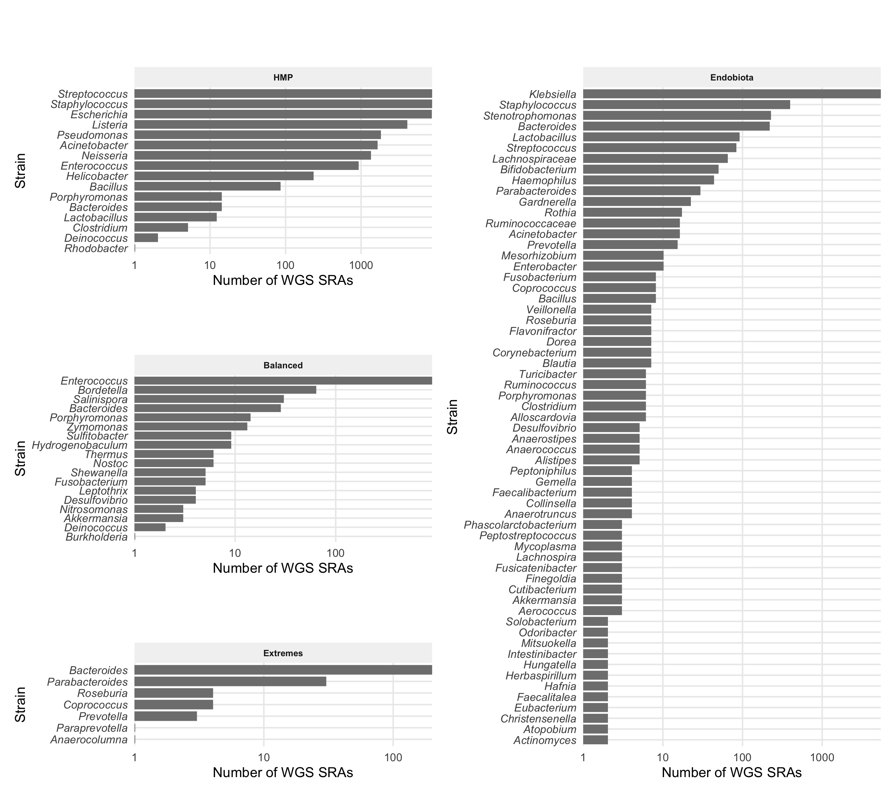

```{r setup-sup, include=FALSE}
knitr::opts_chunk$set(echo = FALSE, cache.lazy = FALSE)
library(tidyverse); packageVersion("tidyverse")
library(Biostrings); packageVersion("Biostrings")
#if (!requireNamespace("BiocManager", quietly = TRUE))
#    install.packages("BiocManager")
#BiocManager::install("DECIPHER")
library(ggupset)
library(patchwork)
library(DECIPHER)
source("../docs/shared.R")
results_dir <- "../results/2019-12-19-results/"
figures_dir <- "../docs/figures/"
REPROCESS_RESULTS = FALSE
```
# Introduction
This document contains all the of steps needed to reproduce the findings presented in this work, with the exception of the community analyses described in `DADA2_analyses.Rmd`; it was written with literate programming, so all code can be viewed in the source document at <https://github.com/femlab/focus16_manuscript/blob/master/docs/>.

## Third-party software versions

The conda environment used for the analyses is defined in  <https://github.com/femlab/focus16_manuscript/blob/master/focus16_env.txt>.

# Data Availability
## Number of SRAs available for each species

A python script `sralist.py` was used to generate a list of the number of SRAs for a given species, based on parsing the results from sraFind from 2019-10-24.  The input files for the "Balanced", "HMP", and "Extremes" were created from the descriptions of the mock communities found in the their respective publications[@schirmer_insight_2015;@kozich_development_2013;@callahanDADA2HighresolutionSample2016;@ataEndobiotaStudyComparison2019].  Generating the Endobiota species file is described in `DADA2_analyses.Rmd` section "Preliminary taxa assignment for EndoBiota study".

The results per dataset are shown in Figure S\@ref(fig:pfig). Because some genera have thousands of SRAs, we limited subsequent analyses to 50 SRAs per genus.

```{bash eval=FALSE}
python scripts/sralist.py -s  ~/.focusDB/sraFind.tab -l ./docs/datasets/extreme_species_list.txt -o results/Extremes_sra_count
python scripts/sralist.py -s ../16db/sraFind-All-biosample-with-SRA-hits.txt -l ./docs/datasets/balanced_species_list.txt -o results/Balanced_sra_count
python scripts/sralist.py -s ../16db/sraFind-All-biosample-with-SRA-hits.txt -l ./docs/datasets/HMP_species_list.txt -o results/HMP_sra_count
python scripts/sralist.py -s ../16db/sraFind-All-biosample-with-SRA-hits.txt -l ./docs/microbiome_data/endo_species.txt -o results/endo_sra_count
```

```{r plot_sras, eval=REPROCESS_RESULTS}
srac <- data.frame("org"=character(), "ncount"=numeric(), stringsAsFactors = F)
###
for (d in c("Extremes", "HMP", "Balanced")){
  thispath = file.path("../results", paste0(d, "_sra_count"), "sralist.txt")
  tmp <- read.csv2(thispath, sep=":", col.names = c("org", "ncount"), stringsAsFactors = F, header=F)
  tmp$mock <- d
  srac <- rbind(srac, tmp)
}
## add endo data
thispath = file.path("../results", paste0("endo", "_sra_count"), "sralist.txt")
tmp <- read.csv2(thispath, sep=":", col.names = c("org", "ncount"), stringsAsFactors = F, header=F)
tmp$mock <- "Endobiota"
srac <- rbind(srac, tmp)


srac$genus <- gsub("(.*) .*","\\1", srac$org)
srac$species <- gsub("(.*) (.*)","\\2", srac$org)
srac$binom <- paste(srac$genus, srac$species)
nunique_strains <- length(unique(srac[, "org"]))
nunique_genera <- length(unique(srac[, "genus"]))
nwith_sras <- length(unique(srac[srac$ncount > 0, "org"]))
ngenerawith_sras <- length(unique(srac[srac$ncount > 0, "genus"]))

# psrastrains <- ggplot(srac %>% filter(ncount > 0)  %>% group_by(mock) %>% top_n(ncount, n = 25), 
#                        aes(reorder(org,ncount), y=ncount, fill=genus, color=genus)) + 
#     geom_bar(stat="identity") +
#     coord_flip() + 
#   scale_y_log10() +
#     scale_color_discrete(guide=F) +
#     scale_fill_discrete(guide=F) +
#     facet_wrap(~mock, scales = "free") +
#     labs(
#       title=" ", 
#       subtitle=paste0(nrow(srac %>% filter(ncount > 0)), " of ", nunique_strains, " organisms have availabe SRA data "),
#       fill="Genus",
#      color="Genus",
#      y= "Number of WGS SRAs", x="Strain") + 
#     mytheme +
#     theme(legend.position = c(.8, .3),
#           axis.text.y  = element_text(face = "italic"),
#           text = element_text(size=8))
srac_summary <- srac %>% filter(ncount > 0) %>% group_by(mock, genus) %>% summarize(genus_count=sum(ncount)) %>% group_by(mock) %>% top_n(genus_count, n = 50) 
plot_dataset <- function(df){
  ggplot(df , 
         aes(reorder(genus, genus_count), y=genus_count, fill=genus, color=genus)) + 
    geom_bar(stat="identity", width=.7, fill="gray50", color="gray50") +
    coord_flip() + 
    scale_y_log10(expand = c(0, 0)) +
    scale_color_discrete(guide=F) +
    scale_fill_discrete(guide=F) +
    facet_wrap(~mock, scales = "free") +
    labs(
      title="", 
      subtitle="",
      fill="Genus",
      color="Genus",
      y= "Number of WGS SRAs", x="Strain") + 
    mytheme +
    theme(legend.position = c(.8, .3),
          axis.text.y  = element_text(face = "italic"),
          text = element_text(size=8))
}
psra_ndo <- plot_dataset(srac_summary %>% filter(mock=="Endobiota"))
psra_hmp <- plot_dataset(srac_summary %>% filter(mock=="HMP"))
psra_bal <- plot_dataset(srac_summary %>% filter(mock=="Balanced"))
psra_ext <- plot_dataset(srac_summary %>% filter(mock=="Extremes"))
combined_plots <- (psra_hmp/psra_bal/psra_ext + plot_layout(heights = c(.4,.4,.2))) | psra_ndo +  plot_layout(guides = 'auto')
paste0(ngenerawith_sras, " of ", nunique_genera, " genra have available SRA data ")
ggsave("../docs/figures/S1-sras.png", combined_plots, device = "png", dpi = 300, width = 9, height = 8)
``` 

```{r pfig, fig.cap="Whole-genome sequencing SRA data availability for strains in the four datasets. Bars show the number of SRAs per genus as of 2019-10-24. Genera with no publicly available SRAs are removed; results are displayed on a log scale. 109 of 193 genera have availabe SRA data. Clinically-relavent genera tend to have many SRAs.", out.width="100%"}


```


```{r calc-dataset-overlap, eval=REPROCESS_RESULTS}
species_names <- data.frame(genus=character(), species=character(), dataset=character(), stringsAsFactors = F)
# note that we use the "genus" level list for the EndoBiota study because we had to clean up some of the bad annotations where text like "group_X" would be listed as the genus, while a valid genus would be listed at the family level.
for (f in c(Sys.glob("../docs/datasets/*species*"), "../docs/microbiome_data/endo_genus.txt")){
  species_names <- rbind(
    species_names, 
    cbind(read.csv(f, sep=" ", stringsAsFactors = F, header=F, col.names = c("genus", "species")), dataset=f)
  )
  print(f)
}
unique_genuses <- unique(srac[, "genus"])
unique_genuses_with_sras <- unique(srac[srac$ncount > 0, "genus"])

proks <- read.csv2("~/.focusDB/prokaryotes.txt", sep="\t", header = T, stringsAsFactors = F)
proks$genus <- gsub("(.*?) .*", "\\1", proks$X.Organism.Name)
theseproks <- left_join(
  species_names  %>%  select(-species), 
  proks %>% 
    filter(Status %in% c("Chromosome", "Complete Genome")) %>% 
    mutate(ref=T) %>%
    select(genus, ref) %>% distinct()
)  %>%
  transform(ref=ifelse(is.na(ref), F, ref)) %>%
  distinct() %>%
  mutate(sras = genus%in% unique_genuses_with_sras) %>%
  transform(
    dataset = case_when(
      grepl("balanced", dataset) ~ "Balanced",
      grepl("HMP", dataset) ~ "HMP",
      grepl("extreme", dataset) ~ "Extremes",
      grepl("endo", dataset) ~ "Endobiota"
    )
  ) %>% 
  mutate(
    exclusion = case_when(
      !sras & !ref ~ "No SRAs or Reference",
      !sras  ~ "No SRAs",
      !ref ~ "No Reference",
      sras & ref ~ "Eligible"
    )
  )
summary_table_overlap <- theseproks %>%  group_by(dataset, exclusion) %>% select(-genus, -ref, -sras) %>% summarize(v = n()) %>% pivot_wider(id_cols = c(dataset), names_from = exclusion, values_from = v, values_fill = list(v = 0)) %>%
  column_to_rownames("dataset") %>% as.data.frame()
p_dataset_overlap <-  theseproks %>%   group_by(genus, exclusion) %>%
    summarize(ds = list(dataset)) %>% 
    ggplot(aes(x = ds, fill=exclusion)) +
    geom_bar(position=position_stack(reverse = TRUE)) + 
    labs(title="Genus-level overlap of datasets", 
         x="Dataset", y="Count", fill="") +
    scale_fill_manual(values=wesanderson::wes_palette("IsleofDogs2")[4:1]) +
    mytheme +
    scale_x_upset()+
    theme(
      legend.position=c(.8,.6),
      legend.background = element_blank(),
      legend.direction='vertical') +
    guides(fill = guide_legend(reverse = TRUE))


#species_names %>% ggplot(aes(x=dataset, y=genus)) + geom_tile()
unique_and_valid <- theseproks %>% select(genus, ref, sras) %>% distinct() %>%
  filter(sras) %>% filter(ref)
write.table(sort(unique_and_valid$genus), col.names = F, row.names = F, file = "../docs/datasets/combined_genuses.txt", quote=F)

ggsave("../docs/figures/S6-datasets.png", 
       p_dataset_overlap, 
       device = "png", dpi = 300, width = 6, height = 5)
ggsave("../docs/figures/S6-datasets-log.png", 
       p_dataset_overlap + scale_x_upset(ytrans = "log1p") , 
       device = "png", dpi = 300, width = 6, height = 5)
ggsave("../docs/figures/S6-datasets-tab.png", 
p_dataset_overlap | gridExtra::tableGrob(summary_table_overlap, theme = gridExtra::ttheme_default(base_size=9 )),
       device = "png", dpi = 300, width = 10, height = 6)
```


```{r datasets, echo=FALSE, fig.cap="368 genera across the four datasets were considered.  Of the 333 unique genera, 85 met our criteria of having public short-read data in the SRA and at least one RefSeq complete genome available. The x axis shows the overlapping sets of genera among the four dataset; the color shows how many of the genera met the inclusion criteria.  While only a fraction of the SRAs meet the requirements for reassembly, future data availability will allow us to revisit previously-excluded SRAs.", out.width = '80%'}
knitr::include_graphics("figures/S6-datasets-tab.png")
```


\newpage
# Running Focus16 on candidate taxa 
## Parameter choice
Below is a copy of the script used to run the pipeline for the list of genera determined above. the following parameters were used:

- `--n_references 200`:  the maximum number of RefSeq genomes to consider for use as a reference
- `--n_SRAs 50`: limits reassembly to 50 random SRA readsets per genus
- `--run_de_novo_control`: ensures riboSeed run a control *de novo* assembly with SPAdes.  This is used for mcomparisons of the *de novo* assembly to the *de fere novo* assemblies.
- `--maxdist .1`: set the maximum Mash distance between a reference genome and a preliminary assembly
- `-v 1`: sets verbosity
- `--fastqtool fastq-dump`: prefer fastq-dump to fast(er)q-dump 
- `--timeout 1500`: sets download limit for 25 minutes; we found downloads lasting long than that usually were hanging
- `--process_partial `: if a download times out, proceed with the reads downloaded 
- `--use_available`: use any reads downloaded during while previously processing an SRA
- `--sge`: distribute assembly tasks as an SGE array job on the HPC
- `--sge_env 16db`: name of the conda environment that the distributed jobs to be executed with
- `--njobs 6` : number of tasks to be run concurrently for each SGE array 
- `--threads 2`: resource allocation for main job
- `--cores 6`: resource allocation  for main job
- `--memory 20`: resource allocation for main job

\newpage

```{bash  eval=FALSE, echo=TRUE}
#!/bin/bash
#$ -t 1-85
#$ -tc 15
#$ -cwd
#$ -j yes
#$ -N comb_genus
#$ -pe mpi 4
#$ -l h_vmem=20G
set -e
counter=1

cd /mnt/shared/scratch/synology/nw42839/2019-11-04-focusdb/
while read genus species
do
    if [ "$counter" -eq "$SGE_TASK_ID" ]
    then
        conda activate 16db
        focusDB  -o ${genus}_genus --organism_name "${genus}" --njobs 6 --threads 2 \
        --cores 6 --memory 20 --n_references 200 --n_SRAs 50 --maxdist .1 \
        --focusDB_data /mnt/shared/scratch/nw42839/.focusDB/ -v 1 --timeout 1500 \
        --fastqtool fastq-dump --process_partial --use_available --sge --sge_env 16db
    fi
    counter=$((counter + 1))
done < ~/GitHub/focusdb_manuscript/docs/datasets/combined_genuses.txt
```

Afterwards, the results were aggregated, and then were moved to this repo under the `results` dir.

\newpage

```{bash eval=FALSE}
mkdir 2019-12-19-results
while read genus; do echo $genus; cp ./${genus}_genus/${genus}_fast_ribo16s.fasta ./2019-12-19-results/;  cp ./${genus}_genus/${genus}_full_ribo16s.fasta ./2019-12-19-results/ ; cp ./${genus}_genus/focusDB.log ./2019-12-19-results/${genus}.log ; cp ./${genus}_genus/sequence_summary.tab  ./2019-12-19-results/${genus}_seq_summary.tab; done < ~/GitHub/focusdb_manuscript/docs/datasets/combined_genuses.txt
cp --parents ./*_genus/*/results/riboSeed/seed/final_de_novo_assembly/contigs.fasta ./2019-12-19-results/
cat ./*_genus/SUMMARY > 2019-12-19-results/summary_all
cat ./2019-12-19-results/*seq_summary.tab > 2019-12-19-results/sequence_summary_all.tab
tar czf 2019-12-19-results.tar.gz 2019-12-19-results/

```


## List of References Considered
After execution of the pipeline, all of the references considered were recorded as follows:
```
while read genus ; do \
for j in  .focusDB/references/$genus/*.fna; do \
echo -e "${genus}\t${j}" >> ~/GitHub/focusdb_manuscript/docs/reference_genomes.tab ; \
done ;done < ~/GitHub/focusdb_manuscript/docs/datasets/combined_genuses.txt
```


```{r calc-refs-per, eval=REPROCESS_RESULTS}
reference_df <- read.csv("../docs/reference_genomes.tab", sep="\t", col.names = c("genus", "ref"), header=FALSE)
ggplot(reference_df %>% group_by(genus) %>% summarize(n=n()), aes(x=genus, y=n)) + geom_bar(stat="identity") + coord_flip()
ggsave(
  "../docs/figures/S7-refs.png", 
ggplot(
  reference_df %>% group_by(genus) %>% summarize(Genera="", n=n()), aes(x=Genera, y=n)) +
  ggbeeswarm::geom_quasirandom(size=3, alpha=.4, beeswarmArgs=list(side=1)) + mytheme + labs(y="Number of\n RefSeq References Available", x="Genera") + coord_flip()    ,
       device = "png", dpi = 300, width = 6, height = 2)
# getting the median
tmp <- reference_df %>% group_by(genus) %>% summarize(Genera="", n=n())
median(tmp$n)
print(tmp[tmp$n >= 200, ])
```

```{r reference-datasets, echo=FALSE, fig.cap="A median of 9 references were available for each of the genera considered. The number of references per genera was capped at 200.  In practice, this only effected the Bordetella genus.  Data was plotted with ggbeeswarm using the quasirandom layout to show the distribution.", out.width = '80%'}
knitr::include_graphics("figures/S7-refs.png")
```

## List of SRAs

After the pipeline was run, the SRAs processed for each genus was recorded.

```
ls -d results/2019-12-19-results/*_genus/* > docs/sras.tab
```

# Quality Control
## Diagnosing poor assemblies

In the course of comparing the reassembled sequences to those for which reference genomes were available, we determined that the pipeline struggled in two cases: the *Treponema* genus, and one *Bacillus anthracis* SRA: SRR2155541.  We do not currently know the issue with the *Treponema* genus, but using blobtools we determined that SRR2155541 is contaminated with *Micrococcus luteus* (Figure \@ref(fig:blob-bacillus)).

```{bash blobforSRR2155541, eval=FALSE, echo=TRUE}
# we downloaded GCF_000008165.1_ASM816v1_genomic.fna as a reference
docker run --memory 16G --rm  -v $PWD:/home/ nickp60/ezblobtools \
  -r /home/results/2019-12-19-results/Bacillus_genus/SRR2155541/results/riboSeed/seed/final_de_novo_assembly/contigs.fasta   \
  -d ref_prok_rep_genomes -o /home/GitHub/focusdb/docs/blob_SRR2155541/ -t 2 -m 16
```

```{r blob-bacillus, echo=FALSE, fig.cap="Assessing the contents of *Bacillus anthracis* SRA SRR2155541 showed possible contamination with *Micrococcus luteus*, as can be seen from the coverage and GC content differences.", out.width = '60%'}
knitr::include_graphics("blob_SRR2155541/blob_all/all.blobDB.json.bestsum.species.p8.span.100.blobplot.velvet.png")
```

## Identifying poor taxonomic assignments
In addition to those mentioned above with poor assemblies, we filtered out any SRAs with inconclusive domain-level agreement, where Kraken reports the top level Domain taxonomy with less than 70% agreement . This primarily intended to remove datasets with poor host-DNA depletion.

```{r calc-tax-agreement, eval=REPROCESS_RESULTS}
tax_summary <- read.csv(
  file.path(results_dir, "sequence_summary_all.tab"),
  col.names = c("id", "path","source", "start", "end", "taxonomy", "perc", "nseqs", "shortname"), 
  header=FALSE, sep="\t", stringsAsFactors = FALSE)
tax_summary$root_perc <- as.numeric(gsub("(.*?);.*", "\\1", tax_summary$perc))
tax_summary$domain_perc <- as.numeric(gsub("(.*?);(.*?);.*", "\\2", tax_summary$perc))
tax_summary$phylum_perc <- as.numeric(gsub("(.*?);(.*?);(.*?);.*", "\\3", tax_summary$perc))
tax_summary$sra <- gsub("(.*?)_.*", "\\1", tax_summary$id)

ggsave( file="../docs/figures/aggreement.png", device = "png", dpi = 300, width = 5, height = 5,
        ggplot(tax_summary, aes(x=domain_perc, fill=domain_perc>70)) + geom_histogram(bins=30) + 
          labs(title="", subtitle="Histogram of Domain-level taxonomic assignment percentages", y="Number of sequences", fill="Domain-level Assignment > 70%") + theme(legend.position = "bottom") 
)
questionable_annotation_sras <- unique(tax_summary[tax_summary$domain_perc < 70 | grepl("Homo sapiens", tax_summary$taxonomy), "sra"])
questionable_annotation_sras <-c(questionable_annotation_sras, "SRR2155541")
write.table(questionable_annotation_sras, file = "../bad_sras.txt", row.names = FALSE, col.names = FALSE, quote=FALSE)

print(length(unique(tax_summary[grepl("Homo sapiens", tax_summary$taxonomy), "sra"])))
```

```{r tax-agreement-plot, echo=FALSE, fig.cap="Datasets where Kraken's taxanomic assignment of preliminary assembly contigs showed less  less than 70 percent agreement  were removed, as these are likely contaminated with host DNA", out.width = '50%'}
knitr::include_graphics("figures/aggreement.png")
```

Figure \@ref(fig:tax-agreement-plot) shows a histogram of the domain-level agreement. We parse the outputs from Kraken2's taxonomic assignment, and flag any with a low (<70) percent of domain-assigned sequences, as this could indicate that an SRA is contaminated.  Some (such as Treponema SRAs 	SRR3571775 and SRR3584844) have $\approx$ 60% human DNA, indicating incomplete removal of host DNA, and as such, we drop them. as such, we lose 9 SRAs.  However, it should be noted that BLASTing contigs from these assemblies appear to show bacterial DNA -- the Kraken2 database itself may have contamination where Treponema kmers are labelled as human.  Either way, these (and any other under the 70% domain-level assignment threshold) are dropped.


# Results
## Assessing per-SRA outcomes of the pipeline

The outcome of each SRA was determined after running the pipeline. For the purposes of this figure, the following messages were combined:

- `Error`:
  - Any errors involving riboSeed
  - Error downloading datasets or references
  - Unknown errors
- `QC Fail`:
  - Invalid library type (eg mate-paired reads)
  - Reads < 65bp (eg early Genome Analyzer reads)
  - Reads > 300bp (eg PacBio or Nanopore reads)
  - Insuffient coverage < 15x

```{r plot_success, eval=REPROCESS_RESULTS}
summary_data <- read.csv(file.path(results_dir, "summary_all"),
                    sep="\t", header=F,
                    col.names = c("org", "status", "state", "messag"), 
                    stringsAsFactors = F)
# first, we drop anything with questionable annotations
table(summary_data$state %in% questionable_annotation_sras)
summary_data <- summary_data[!summary_data$state %in% questionable_annotation_sras, ]

# here we get rid of those withougt references by matching up with unique_and_valid
summary_data <- summary_data %>% filter(org %in% unique_and_valid$genus)
globals <- summary_data %>% filter(state=="global") %>%
  select(org, messag) %>% dplyr::rename(globalmessage=messag)
summary_data <- summary_data %>% filter(state!="global")
globals$globalmessage <- ifelse(globals$globalmessage == "", "Success", globals$globalmessage)
# tidy things up;  this clarifies the immage a bit
globals$globalmessage <- gsub("No 16s sequences detected in re-assemblies", "Success", globals$globalmessage)
# (globals$globalmessage <- gsub("No available.*", "No available references", globals$globalmessage))

p_summary_data_pre <- full_join(
  summary_data , globals, by=c("org")) %>% 
  select(org, globalmessage, messag, state ) %>%  distinct()

p_summary_data <- right_join(srac,  p_summary_data_pre, by=c("org")) %>% 
  mutate(
    strain=org, 
    pmessage = case_when(
      startsWith(messag, "Unknown error selecting reference") ~ "Error",
      is.na(messag) ~ "QC Fail",
      startsWith(messag, "Library error") ~ "QC Fail",
      startsWith(messag, "Reads under") ~ "QC Fail",
      startsWith(messag, "Reads over") ~ "QC Fail",
      startsWith(messag, "No reference meets threshold") ~ "No close reference",
      startsWith(messag, "Reads under the") ~ "QC Fail", 
      startsWith(messag, "Insufficient coverage") ~ "QC Fail", 
      startsWith(messag, "Unknown crit") ~ "Error",
      startsWith(messag, "Error downloading") ~ "Error",
      messag=="" ~ "16S Recovered", 
      messag=="riboSeed unsuccessful" ~ "No 16S Recovered")) 

# #  plot mock also in shared methods
# for (grp in  c("Extremes",  "Balanced", "Endobiota")){
#   thisgroup <- quo(grp)
#   (mock_plots[[grp]] <- plot_mock(df=p_summary_data%>% filter(mock == (!!thisgroup))))
#   ggsave(paste0("../docs/figures/S2", grp, ".png"), mock_plots[[grp]], device = "png", dpi = 300, width = 12, height = 7)
# }
(mock_plots <- plot_genera(df=p_summary_data))
ggsave(paste0("../docs/figures/2-genera.png"), plot_genera(df=p_summary_data), device = "png", dpi = 300, width = 10,  height = 13)
```


## Extracting 16S rRNA from de novo assemblies
For the comparison of error rates between the *de fere novo* assembly and *de novo* assembly, `make_silva_style_db_from_contigs.py` was used  to identify 16S regions using Barrnap and extract those regions from the  *de novo* contigs .

```{bash, eval=FALSE}
rm ./results/2019-12-19-results/pre_denovo_focusDB_ribo16s.fasta
for i in results/2019-12-19-results/*_genus/*/
do 
echo $i
thissra=$(basename $i)
contigs="${i}/results/riboSeed/seed/final_de_novo_assembly/contigs.fasta"
python ../py16db/make_silva_style_db_from_contigs.py --name $thissra $contigs  ./results/2019-12-19-results/pre_denovo_focusDB_ribo16s.fasta
done

```

## Assessing uniqueness
First, for simplicity, we combine all the sequences for all the runs. We have the logs to relate the sequences to why they were selected, but as we are talking about improving the database as a whole, combining them all simplifies aspects of interpretation.

<!-- Note that first we remove any with dodgey taxonomic annotations, hence thhe inverse grep for the SRAs which fell beneath the 70% assignment threshold. -->

We removed any from the list a identified above in section "Identifying poor taxonomic assignments".
```{bash, eval=FALSE}
cat ./results/2019-12-19-results/*full_ribo16s.fasta  > ./results/2019-12-19-results/pre_full_focusDB_ribo16s.fasta
cat ./results/2019-12-19-results/*fast_ribo16s.fasta  > ./results/2019-12-19-results/pre_fast_focusDB_ribo16s.fasta
```
```{r eval=REPROCESS_RESULTS}
for (f in c("full", "fast", "denovo")){
  file.remove(paste0(results_dir, f,"_focusDB_ribo16s.fasta"))
  lines <- readLines(paste0(results_dir, "pre_", f,"_focusDB_ribo16s.fasta"))
  newlines = c()
  skip <- 0 
  for (i in 1:length(lines)){
    if (any(sapply(questionable_annotation_sras, grepl, lines[i]))){
      skip <- 2
    }
    if (skip > 0){
      skip <- skip - 1
    } else {
      newlines <- c(newlines, lines[i])
    }
  }
  writeLines(newlines, paste0(results_dir, f,"_focusDB_ribo16s.fasta"))
}
```


##  Assessing SILVA's composition
```{bash, eval=FALSE}
if [ -f "~/Downloads/SILVA_132_SSURef_tax_silva.fasta.gz" ] ; then echo "already downloaded" ; else wget    https://www.arb-silva.de/fileadmin/silva_databases/release_132/Exports/SILVA_132_SSURef_tax_silva.fasta.gz ; fi
```

First, we read in the SILVA db, and parse the headers for later comparison. One thing we do it get the codes of what the prefixes from NCBI mean, and use that to determine with source of the sequences.  The list of prefixes can be found at <https://www.ncbi.nlm.nih.gov/Sequin/acc.html>.

```{r parse_headers, eval=REPROCESS_RESULTS}
 
process_db <- function(xset){
  # codes_from_ncbi read in shared.R
  headers <- data.frame("raw"=names(xset), stringsAsFactors = F)
  headers$pre <- gsub("(\\D*).*", "\\1", headers$raw)
  headers$id <- gsub("(.*?)\\.(.*)", "\\1", headers$raw)
  headers$strain <- gsub("(.*?)\\.(.*?)\\.(.*)\\s.*;(.*)", "\\4", headers$raw)
  headers$genus <- gsub("(.*?)\\s(.*)", "\\1", headers$strain)
  headers$species <- gsub("(.*?) (.*)", "\\1", gsub("(.*?)\\s(.*)", "\\2", headers$strain))
  headers$binom <- paste(headers$genus, headers$species)
  #headers$name <- gsub(">(.*?)\\s.*", "\\1", headers$raw)
  headers$start <- as.numeric(gsub("(.*)\\.(.+)\\.(.*?)\\s.*", "\\2", headers$raw))
  headers$stop <-  as.numeric(gsub("(.*)\\.(.+)\\.(.*?)\\s.*", "\\3", headers$raw))
  headers$wgs <- nchar(headers$pre) > 3 # see table
  headers$amplicon <- headers$start < 10
  
  
  genome_pres <- codes_from_ncbi %>% 
    filter(Type=="Genome project data") %>% 
    mutate(Prefix = strsplit(Prefix, ",")) %>% unnest(Prefix) %>%
    transform(Prefix=gsub(" ", "", Prefix)) %>% 
    select(Prefix) 
  patent_pres <- codes_from_ncbi %>% filter(grepl("Patent", Type)) %>%
    mutate(Prefix = strsplit(Prefix, ",")) %>% unnest(Prefix) %>%
    transform(Prefix=gsub(" ", "", Prefix)) %>% 
    select(Prefix) 
  headers$cg <- headers$pre %in% genome_pres$Prefix
  headers$patent <- headers$pre %in% patent_pres$Prefix
  headers$htgs <- headers$pre %in% c("AC", "DP")
  
  table(headers$cg) / nrow(headers)
  table(headers$wgs) / nrow(headers)
  table(headers$amplicon) / nrow(headers)
  
  headers$category <- case_when(
    headers$wgs ~ "Draft",
    headers$htgs ~ "HTGS",
    headers$patent ~ "Patent",
    headers$cg ~ "Complete Genome",
    headers$amplicon ~  "Amplicon")
  round(table(headers$category, useNA = "always") / nrow(headers) * 100, 2)
  headers$matcher <- ifelse(
    headers$cg, 
    headers$id,
    ifelse(headers$wgs, 
           substr(headers$id, start = 1, stop =( nchar(headers$pre) + 2)),
           NA)
  )
  return( headers )
}
#datasets <- list()  #first item string set, second is the header info
silva <- readRNAStringSet("~/Downloads/SILVA_132_SSURef_tax_silva.fasta.gz")

# what is the average rRNA length?
hist(silva@ranges@width)
summary(silva@ranges@width)
# keep in mind barrnap model has a max length of 1533

# first, we need to exclude any bad sequences
all_focus_full <- readRNAStringSet(file.path(results_dir, "full_focusDB_ribo16s.fasta"))
all_focus_fast <- readRNAStringSet(file.path(results_dir, "fast_focusDB_ribo16s.fasta"))
de_novo <-  readRNAStringSet(file.path(results_dir, "denovo_focusDB_ribo16s.fasta"))


datasets <-  list(
  silva = list(set = silva, metadata = process_db(xset=silva)),
  fast =  list(set = all_focus_fast, metadata = process_db(xset=all_focus_fast)), 
  full =  list(set = all_focus_full, metadata = process_db(xset=all_focus_full)),
  denovo = list(set = de_novo, metadata = process_db(xset=de_novo))
)

uniqueness <- data.frame(
  "Organism" = character(),
  "Unique" = numeric(),
  "Duplicated" = numeric(),
  "DB" = character(),
  stringsAsFactors = F
)
#uniqueness <- uniqueness[!is.na(uniqueness),]
# note that we only get the species level resultts here, later we address the genus level

#all_focus <- all_focus[!duplicated(all_focus), ]
for (i in c("silva", "full", "fast")){
  set <- datasets[[i]]
  raw_len <- length(set[["set"]])
  print(raw_len)
  thisset <- set[["set"]][lapply(vmatchPattern("N", set[["set"]])@ends, length) == 0]
  thisset <- thisset[lengths(thisset) > 1200]
  no_n_len <- length(thisset)
  if (no_n_len != raw_len) warning(paste0(" ",raw_len-no_n_len, " sequences with ambiguous nucleotides from the '", i, "' dataset"))
}

# check_uniqueness
counter <- 1
for (organism in unique(datasets[["fast"]][["metadata"]]$binom)){
  #rganism <- gsub("_", " ", gsub(".*\\/(.*)_ribo16s.fasta", "\\1", path))
  print(paste("processing", organism, counter, "of", length(unique(datasets[["fast"]][["metadata"]]$binom))))
  silva_subset <-silva[grepl(organism, names(datasets[["silva"]][["set"]]))]
  nsilv <- length(silva_subset)
  nsilvdup = sum(duplicated(silva_subset), na.rm = TRUE)
  uniqueness <- rbind(
    uniqueness, 
    data.frame("Organism"=organism, "Unique"=nsilv-nsilvdup,  "Duplicated"=nsilvdup, "DB"="silv"))
  # focus_subset <- readDNAStringSet("./results/2019-10-12-focusdb-extremes/Bacteroides_fragilis_ribo16s.fasta")
  focus_subset <- datasets[["fast"]][["set"]][grepl(organism, names(datasets[["fast"]][["set"]]))] 
  nfoc <- length(focus_subset)
  nfocdup = sum(duplicated(focus_subset), na.rm = TRUE)
  uniqueness <- rbind(
    uniqueness, 
    data.frame("Organism"=organism, "Unique"=nfoc-nfocdup,  "Duplicated"=nfocdup, "DB"="focus"))
  both_subsets  <- append(DNAStringSet(silva_subset), focus_subset)
  nboth <- length(both_subsets)
  nbothdup = sum(duplicated(both_subsets), na.rm = TRUE)
  uniqueness <- rbind(
    uniqueness, 
    data.frame("Organism"=organism, "Unique"=nboth-nbothdup,  "Duplicated"=nboth, "DB"="combined"))
  counter <- counter + 1
}
#  plotting_uniqueness

#uniqueness <- uniqueness[1105:nrow(uniqueness), ]
# set an arbtrary cutoff for popularity, just for plotting purposes
popthresh = 100; popular <- uniqueness %>% filter(DB=='silv') %>% filter(Unique > popthresh | Duplicated > popthresh) 
#popular$Organism <- as.character(popular$Organism)
p_uniqueness <- uniqueness %>% distinct() %>% gather(key="grp", value="val", -Organism, -DB ) %>%
  spread(key=DB, value=val) %>% 
  mutate(SILVA=combined-focus, focusDB=combined-silv) %>% 
  select(-silv, -combined, -focus)  %>%
  gather(key="DB", value="val", -Organism, -grp ) %>%
  # reverse levels for plottting
  mutate(Organism = factor(Organism), 
         Organism = factor(Organism, levels = rev(levels(Organism))))
(p_unique <- ggplot(
  p_uniqueness, 
  #%>% mutate(fac = ifelse(Organism %in% popular$Organism, "Over-represented", "Under-represented")),
  aes(x=Organism, y=val, alpha=grp, group=grp, fill=DB)) +
    coord_flip() +
    #facet_wrap(~fac, scales="free") +
    scale_fill_manual(values = viridis::viridis(n=3)[c(2, 1)]) +
    scale_alpha_manual(values = c(.2, 1)) + mytheme +
    labs(y="Number of Sequence", x="", alpha="", fill="Database") +
    theme(axis.text=element_text(size=13)) +
    geom_bar(stat="identity", position="stack") #+ facet_wrap(~grp) 
)
(p_unique_alt <- ggplot(
  p_uniqueness %>% 
    #mutate(fac = ifelse(Organism %in% popular$Organism, "Over-represented", "Under-represented"))%>% 
    filter(grp=="Unique"),
  aes(x=Organism, y=val,  fill=DB)) +
    coord_flip() +
    #facet_wrap(~fac, scales="free") +
    scale_fill_manual(values = viridis::viridis(n=3)[c(2, 1)]) +
    scale_alpha_manual(values = c(.2, 1)) + mytheme +
    labs(y="Number of Sequence", x="", alpha="", fill="Database") +
    theme(axis.text=element_text(size=13)) +
    geom_bar(stat="identity", position="stack") #+ facet_wrap(~grp) 
)
p_unique_perc <-  
  p_uniqueness %>% spread(grp, val) %>%
    dplyr::rename(binom=Organism) %>%
    select(-Duplicated) %>% spread(DB, Unique) %>% 
    mutate(
      perc_inc=round((focusDB/SILVA) *100, 1 ),
      perc_of_tot=round(focusDB/((SILVA + focusDB)) *100, 1 ),
    )%>% 
  filter(!is.na(perc_inc)) %>% ungroup() %>%
  mutate(genus = gsub("(.*) .*", "\\1", binom)) %>%
  group_by(genus) %>%
  mutate(
    perc_inc_genus=round((sum(focusDB)/sum(SILVA)) *100, 1 ),
    perc_of_tot_genux=round(sum(focusDB)/((sum(SILVA) + sum(focusDB))) *100, 1 ))


# (p_unique_heat <- ggplot(p_unique_perc,
#   aes(x=binom, y=mock, fill=mock)) +
#     coord_flip() +
#     scale_fill_discrete(guide="none")+
#     theme(rect = element_blank(),
#           text=element_text(color="white"),
#           axis.text.y  = element_blank(),
#           axis.text.x  = element_text(size=10),
#           line = element_blank(),
#             
#       )+
#   geom_tile())
(p_unique_species <- ggplot(p_unique_perc %>% distinct(),
  aes(x=binom, y=perc_inc)) +
    coord_flip() +
    scale_fill_manual(values = viridis::viridis(n=3)) +
    mytheme +
    labs(y="Percent increase in Unique Sequences", x="", alpha="", fill="Database") +
    theme(axis.text=element_text(size=13)) +
    geom_bar(stat="identity") #+ facet_wrap(~grp) 
)
(p_unique_genus <- ggplot(
  p_unique_perc %>% group_by(genus, perc_inc_genus) %>% summarise(foc=sum(focusDB)),
  aes(x=reorder(genus, perc_inc_genus), y=perc_inc_genus)) +
    coord_flip() +
    scale_fill_manual(values = viridis::viridis(n=3)) +
    mytheme +
    labs(y="Percent increase in Unique Sequences", x="", alpha="", fill="Database") +
    theme(axis.text=element_text(size=13)) +
    geom_text(aes(y=perc_inc_genus+4, label=foc)) +
    geom_bar(stat="identity") #+ facet_wrap(~grp) 
)


#(figure <- ggpubr::ggarrange(p_unique_heat, p_uniqueV, widths=c(1, 3)))
ggsave("../docs/figures/3-unique.png", p_unique, device = "png", dpi = 300, width = 12, height = 18) 
# length(unique(p_unique_perc$genus))
ggsave("../docs/figures/3-perc_unique.png", p_unique_species, device = "png", dpi = 300, width = 12, height = 10) 
ggsave("../docs/figures/3-perc_unique_genus.png", p_unique_genus, device = "png", dpi = 300, width = 12, height = 10) 
ggsave("../docs/figures/3-unique_alt2.png", p_unique_alt, device = "png", dpi = 300, width = 12, height = 10)
#ggsave("docs/figures/3-unique_alt.png", figure, device = "png", dpi = 300, width = 12, height = 10)

```


```{r tabledata, eval=FALSE}
A <- uniqueness %>% select(Organism, Unique, DB ) %>% distinct() %>%spread(key=DB, value=Unique)
B <- p_summary_data %>% select(strain, pmessage, state) %>% filter(!is.na(state)) %>% group_by(strain) %>% summarise(All_SRAs=n(), Good_SRAs=table(pmessage)["16S Recovered"]) 
right_join(B, A, by=c("strain"="Organism")) %>% 
  #filter(!is.na(All_SRAs)) %>%
  mutate(Genus=gsub("(.*) (.*)", "\\1", strain),
         Species=gsub("(.*) (.*)", "\\2", strain)) %>%
  select(Genus, Species, All_SRAs, Good_SRAs, focus, silv, combined)
 # %>% mutate(perc  = focus/silv*100) %>% select(perc) %>% summary()
```

```{bash eval=FALSE}

# ## Generating Multiple Sequence Alignments
# ### Defining the regions of 16S in E coli
# The coordinates for the common 16S primers correspond to E coli, so we selected this sequence.
# Reference: 
#  - <https://www.ncbi.nlm.nih.gov/nuccore/NC_000913.3?report=fasta&from=4166659&to=4168200>
#  - the regions https://bmcbioinformatics.biomedcentral.com/track/pdf/10.1186/s12859-016-0992-
# These are implemented in the `calculate-shannon-entropy` script.


# Combining sequences
while read genus species; do 
if [ -f "./results/2019-09-26-focusdb-results/${genus}_${species}_ribo16s.fasta" ] ; then \
combine-focusdb-and-silva -d ~/Downloads/SILVA_132_SSURef_tax_silva.fasta -n "$genus $species" -S \
./results/2019-09-26-focusdb-results/${genus}_${species}_ribo16s.fasta --dna --lower  > \
./results/extracted_sequences/${genus}_${species}_db.fasta ; fi; done < ./docs/extreme_species_list.txt
# alignment + trimming
while read genus species; do 
if [ -f "./results/2019-09-26-focusdb-results/${genus}_${species}_ribo16s.fasta" ] ; then \
align-and-trim-focusdb --i ./results/extracted_sequences/${genus}_${species}_db.fasta -o \
./results/extracted_sequences/${genus}_${species}_db ; fi; done < ./docs/extreme_species_list.txt
#  
```


```{r plot_shannon, eval=FALSE, hide=TRUE}
## Calcualting Alpha Diversity

shannon <- read.csv(
  "./tmpalign.mafft.shannon", sep="\t", header = F, 
  col.names = c("pos", "region", "entropy", "entropy_subset"), 
  stringsAsFactors = F) %>% 
  gather(key="subset", value="entropy", -pos, -region) %>%
  mutate(grp = case_when(
    subset == "entropy" ~ "SILVA + focusDB",
    subset == "entropy_subset" ~ "SILVA"
  ))
str(shannon)

(p_diversity <- ggplot(shannon, aes(x=pos, color=grp, shape=grp, fill=region, y=entropy)) + 
    scale_shape_manual(values=c(21, 22)) + 
  geom_point(size=4, alpha=.5) + geom_smooth())
ggsave("../docs/figures/4-diversity.png", p_diversity, device = "png", dpi = 300, width = 11, height = 7)
```


## Assessing the provenance of the SILVA strains
16s sequences in databases such a SILVA, GreenGenes,or RDP can come from several sources, namely:
- complete genomes (in RefSeq, Genbank, etc)
- draft genomes (in the NCBI's Assembly database)
- 16s amplicons from Sanger sequencing
- 16s amplicons from high-throughput amplicon sequencing.

As repeated rDNA operons are difficult to assembly, draft genomes can (and often do) contain a single rDNA.  This is problematic for species ideentification -- the rDNA recovered is not just one of *n* rDNAs, but it can be a consensus "summary" rDNA resulting from trying to assemble the repeated region.  

riboSeed has been show to generate high-quality reconstructions of each rDNA when benchmarked against hybrid assemblies. Here, we compare the 16s sequences from riboSeed reassembly of draft genomes to the initial (potentially collapsed) 16s sequences.


First, we read in the silva headers for the strains. The header for the silva database constists of `>ACCESSION.start.end name`. As of release 0.8, the WGS master record is a column present as "WGS" in sraFind.tab.  This allows us to relate the sequences in the SILVA headers to their original SRAs, so we can compare riboSeed's assemblies to those for which a complete genome is available, and assess the types of errors/collapses we see where only draft genomes are available. 

```{r sraFind, eval=REPROCESS_RESULTS}
# read in the draft linked accessions and the complete genome linked accessions
# if (!file.exists("sraFind.tab")){
#   system("curl -O sraFind.tab -L https://raw.githubusercontent.com/nickp60/sraFind/master/sraFind.tab")
# }
# 
srafind <- read.csv("../sraFind.tab", sep="\t", stringsAsFactors = F)
#  make a boolean mask for all the silva seqs we might care about
ngs_silva <- datasets[["silva"]][["metadata"]][!is.na(datasets[["silva"]][["metadata"]]$matcher), ]
this_mask <- rep(FALSE, nrow(ngs_silva))
these_orgs <- paste(datasets[["fast"]][["metadata"]]$genus, datasets[["fast"]][["metadata"]]$species)
for (org in unique(these_orgs)){
  this_mask <- this_mask | grepl(org, ngs_silva$raw, fixed=T)
}
table(this_mask)
silv_sub <- ngs_silva[this_mask,]
# We take any NZ_ prefix off the complete genome recods.  If you know why silva uses genbank,
# raise an issue on github, using the codeword "vermillion"
srafind$matcher <- ifelse(endsWith(srafind$WGS, "01"), srafind$WGS, 
                          gsub("NZ_", "", gsub("(.*?)\\.(.*)", "\\1", srafind$nuccore_first_chrom), fixed = T))
#View(srafind[grepl(".*_,*",  srafind$nuccore_first_chrom), ])
assembly_summary <- inner_join(
  silv_sub, 
  srafind %>% select(Assembly.Accession, matcher, platform,  run_SRAs) %>% filter(!is.na(run_SRAs)), 
  by="matcher")


(p_summary_draft <- assembly_summary  %>% filter(wgs) %>% group_by(strain,  Assembly.Accession) %>% 
     select(strain, Assembly.Accession, id, start, stop) %>% distinct() %>%  summarize(n=n()))
(p_summary_cg    <-    assembly_summary  %>% filter(cg) %>% group_by(strain,  Assembly.Accession) %>% 
     select(strain, Assembly.Accession, id, start, stop) %>% distinct() %>%  summarize(n=n()))
p_summary_n16s <- assembly_summary %>% select(raw, strain, Assembly.Accession,category) %>%distinct() %>% group_by(strain,  Assembly.Accession) %>%  mutate(n=n()) %>%  select(-raw) %>% distinct()
(p_n16s <-  ggplot(p_summary_n16s, aes(x=n,  fill=category)) +
    #geom_histogram(data=subset(dat,yy == 'a'),fill = "red", alpha = 0.2) +
    #geom_histogram(data=subset(dat,yy == 'b'),fill = "blue", alpha = 0.2) +
    geom_density(adjust=4, alpha=.6, ) + 
    labs(x="Number of 16S  in assembly", y="Relative Distriubtion", fill="", title="Distribution of rDNA counts by assembly level") 
)
ggsave("../docs/figures/S4-n16S.png", p_n16s, device = "png", dpi = 300, width = 6, height = 5)

table(p_summary_n16s[p_summary_n16s$category=="Complete Genome", "n"])
table(p_summary_n16s[p_summary_n16s$category!="Complete Genome", "n"])
# for example, 
# draft_fragilis <- p_summary_draft[grepl("fragilis", p_summary_draft$ScientificName),  ]

```


```{r}
BrowseSeqs2 <- function (myXStringSet, htmlFile = paste(tempdir(), "/myXStringSet.html", 
    sep = ""), openURL = interactive(), colorPatterns = TRUE, 
    highlight = NA, patterns = c("-", alphabet(myXStringSet, 
        baseOnly = TRUE)), colors = substring(rainbow(length(patterns), 
        v = 0.8, start = 0.9, end = 0.7), 1, 7), colWidth = Inf, loc_strings="",
    ...) 
{
    if (!is(myXStringSet, "XStringSet")) 
        stop("myXStringSet must be an XStringSet.")
    if (length(myXStringSet) == 0) 
        stop("No sequence information to display.")
    type <- switch(class(patterns), DNAStringSet = 1L, RNAStringSet = 2L, 
        AAStringSet = 3L, list = -1L, 0L)
    if (type > 0L) {
        patterns <- as.character(patterns)
        if (type == 1L) {
            patterns <- gsub("M", "[ACM]", patterns, fixed = TRUE)
            patterns <- gsub("R", "[AGR]", patterns, fixed = TRUE)
            patterns <- gsub("W", "[ATW]", patterns, fixed = TRUE)
            patterns <- gsub("S", "[CGS]", patterns, fixed = TRUE)
            patterns <- gsub("Y", "[CTY]", patterns, fixed = TRUE)
            patterns <- gsub("K", "[GTK]", patterns, fixed = TRUE)
            patterns <- gsub("V", "[ACGMRSV]", patterns, fixed = TRUE)
            patterns <- gsub("H", "[ACTMWYH]", patterns, fixed = TRUE)
            patterns <- gsub("D", "[AGTRWKD]", patterns, fixed = TRUE)
            patterns <- gsub("B", "[CGTSYKB]", patterns, fixed = TRUE)
            patterns <- gsub("N", "[ACGTMRWSYKVHDBN]", patterns, 
                fixed = TRUE)
        }
        else if (type == 2L) {
            patterns <- gsub("M", "[ACM]", patterns, fixed = TRUE)
            patterns <- gsub("R", "[AGR]", patterns, fixed = TRUE)
            patterns <- gsub("W", "[AUW]", patterns, fixed = TRUE)
            patterns <- gsub("S", "[CGS]", patterns, fixed = TRUE)
            patterns <- gsub("Y", "[CUY]", patterns, fixed = TRUE)
            patterns <- gsub("K", "[GUK]", patterns, fixed = TRUE)
            patterns <- gsub("V", "[ACGMRSV]", patterns, fixed = TRUE)
            patterns <- gsub("H", "[ACUMWYH]", patterns, fixed = TRUE)
            patterns <- gsub("D", "[AGURWKD]", patterns, fixed = TRUE)
            patterns <- gsub("B", "[CGUSYKB]", patterns, fixed = TRUE)
            patterns <- gsub("N", "[ACGUMRWSYKVHDBN]", patterns, 
                fixed = TRUE)
        }
        else {
            patterns <- gsub("B", "[NDB]", patterns, fixed = TRUE)
            patterns <- gsub("Z", "[QEZ]", patterns, fixed = TRUE)
            patterns <- gsub("J", "[ILJ]", patterns, fixed = TRUE)
            patterns <- gsub("X", "[ARNDCQEGHILKMFPSTWYVUOBJZX]", 
                patterns, fixed = TRUE)
            patterns <- gsub("*", "\\*", patterns, fixed = TRUE)
        }
    }
    else if (type == 0) {
        if (!is.null(patterns) && !is.character(patterns)) 
            stop("patterns must be a character vector.")
        if (any(grepl("=|\"|<|>|[1-9]|[a-z]", patterns))) 
            stop("patterns cannot contain numbers, lower case characters, or the characters (=, <, >, \").")
    }
    if (type < 0) {
        if (length(myXStringSet) != length(patterns)) 
            stop("patterns is not the same length as myXStringSet.")
    }
    else {
        w <- which(patterns %in% c("?", "*", "+", "."))
        if (length(w) > 0) 
            patterns[w] <- paste("\\", patterns[w], sep = "")
        if (length(colors) != length(patterns) || !is.character(colors)) 
            stop("colors must be a character vector of the same length as patterns.")
    }
    if (is.character(htmlFile)) {
        htmlfile <- file(htmlFile, "w")
        on.exit(close(htmlfile))
    }
    else {
        stop("'htmlFile' must be a character string or connection.")
    }
    if (!is.logical(openURL) || is.na(openURL)) 
        stop("openURL must be TRUE or FALSE.")
    if (!is.logical(colorPatterns) && !is.numeric(colorPatterns)) 
        stop("colorPatterns must be a logical or numeric.")
    if (is.numeric(colorPatterns)) {
        if ((length(colorPatterns)%%2) == 1 || length(colorPatterns) == 
            0) 
            stop("colorPatterns must specify all start and endpoints.")
        if (any((colorPatterns[seq(2, length(colorPatterns), 
            2)] - colorPatterns[seq(1, length(colorPatterns), 
            2)]) < 0)) 
            stop("colorPatterns specifies a negative range.")
        if (any(colorPatterns <= 0)) 
            stop("colorPatterns must be a positive numeric.")
        if (length(colorPatterns) > 2) 
            if (any((colorPatterns[seq(3, length(colorPatterns), 
                2)] - colorPatterns[seq(2, length(colorPatterns) - 
                2, 2)]) <= 0)) 
                stop("Ranges specified in colorPatterns must be non-overlapping.")
        if (max(colorPatterns) > max(width(myXStringSet))) 
            stop("Ranges specified in colorPatterns are out-of-bounds.")
    }
    if (is.numeric(colorPatterns) & !is.infinite(colWidth)) 
        stop("colWidth must be Inf if colorPatterns is numeric.")
    if (is.null(names(myXStringSet))) 
        names(myXStringSet) <- 1:length(myXStringSet)
    names(myXStringSet) <- gsub("\t", " ", names(myXStringSet), 
        fixed = TRUE)
    if (!is.na(highlight)) {
        if (highlight < 0 || highlight > length(myXStringSet)) 
            stop("highlight must be 0 or the index of a sequence in myXStringSet.")
        if (highlight != floor(highlight)) 
            stop("highlight be be a whole number.")
    }
    if (is(myXStringSet, "DNAStringSet") || is(myXStringSet, 
        "RNAStringSet") || is(myXStringSet, "AAStringSet")) {
        myXStringSet <- c(myXStringSet, ConsensusSequence(myXStringSet, 
            ...))
    }
    else {
        myXStringSet <- c(myXStringSet, as(consensusString(myXStringSet, 
            ...), class(myXStringSet)))
    }
    l <- length(myXStringSet)
    names(myXStringSet)[l] <- "Consensus"
    html <- as.character(myXStringSet)
    if (type < 0) {
        s <- strsplit(html, "", fixed = TRUE)
        n <- nchar(html)
        v <- vector("list", length(html) - 1)
        for (i in seq_len(length(html) - 1)) {
            if (!is.matrix(patterns[[i]])) 
                stop("All elements of the list patterns contain a single matrix.")
            if (nrow(patterns[[i]]) != 3) 
                stop("All elements of the list patterns must be a matrix with 3 rows.")
            if (any(patterns[[i]] < 0) || any(patterns[[i]] > 
                1)) 
                stop("All elements of patterns[[", i, "]] are not between 0 and 1.")
            v[[i]] <- character(n[i])
            if (any(patterns[[i]] > 1) || any(patterns[[i]] < 
                0)) 
                stop("All values of patterns[[", i, "]] must be between 0 and 1.")
            w <- which(s[[i]] %in% c(LETTERS, letters, "*"))
            if (length(w) != ncol(patterns[[i]])) 
                stop("The number of columns in patterns[[", i, 
                  "]] is different than the number of letters in myXStringSet[", 
                  i, "]")
            if (length(w) > 0) 
                v[[i]][w] <- apply(patterns[[i]], 2, function(x) {
                  rgb(x[1], x[2], x[3])
                })
            if (is.numeric(colorPatterns)) {
                start <- 0L
                cPs <- c(colorPatterns, length(v[[i]]) + 1)
                for (j in seq_len(length(cPs))) {
                  if (j%%2) {
                    end <- cPs[j]
                    if (end > length(v[[i]])) 
                      end <- length(v[[i]]) + 1L
                    if (start < end - 1) 
                      v[[i]][(start + 1L):(end - 1L)] <- ""
                  }
                  else {
                    start <- cPs[j]
                    if (start > length(v[[i]]) + 1) 
                      break
                  }
                }
            }
        }
    }
    if (!is.na(highlight)) {
        if (highlight == 0) {
            highlight <- length(html)
            index <- 1:(length(html) - 1L)
        }
        else {
            index <- (1:(length(html) - 1L))[-highlight]
        }
        html <- sapply(html, strsplit, split = "", fixed = TRUE)
        for (i in index) {
            L <- min(length(html[[highlight]]), length(html[[i]]))
            w <- which(html[[i]][1:L] == html[[highlight]][1:L])
            if (length(w) > 0) 
                html[[i]][w] <- "·"
        }
        html <- sapply(html, paste, collapse = "")
    }
    maxW <- max(width(myXStringSet))
    if (maxW == 0) 
        stop("No sequence information to display.")
    if (colWidth > maxW) 
        colWidth <- maxW
    for (i in seq_len(l)) {
        html[i] <- paste(html[i], paste(rep(" ", maxW - nchar(html[i])), 
            collapse = ""), sep = "")
    }
    if (maxW < 20) {
        if (maxW < 10) {
            counter <- maxW
        }
        else {
            counter <- 10
        }
    }
    else {
        counter <- 20
    }
    offset <- (counter - 1) - nchar(maxW)
    if (offset < 0) 
        offset <- 0
    legend <- paste(paste(rep(" ", offset), collapse = ""), format(seq(counter, 
        maxW, by = counter)), collapse = "")
    counter <- ceiling(counter/2)
    tickmarks <- paste(paste(rep("'", counter - 1), collapse = ""), 
        rep("|", floor(maxW/counter)), collapse = "", sep = "")
    tickmarks <- paste(tickmarks, paste(rep("'", maxW - counter * 
        floor(maxW/counter)), collapse = ""), sep = "")
    starts <- seq(1, maxW, colWidth)
    stops <- starts + colWidth - 1L
    stops[length(stops)] <- maxW
    temp <- character((length(html) + 5L) * length(starts))
    count <- 1L
    for (i in 1:length(starts)) {
        temp[count:(count + 1L)] <- substring(c(legend, tickmarks), 
            starts[i], stops[i])
        count <- count + 2L
        temp[c(count:(count + length(html) - 2L), count + length(html))] <- substring(html, 
            starts[i], stops[i])
        count <- count + length(html) + 3L
    }
    html <- temp
    if (length(starts) > 1) {
        lengths <- numeric(length(starts) * l)
        myLengths <- character(length(starts) * (l + 5L))
        for (i in 1:length(starts)) {
            s <- substring(myXStringSet, starts[i], stops[i])
            lengths[((i - 1L) * l + 1L):(i * l)] <- nchar(s) - 
                rowSums(letterFrequency(BStringSet(s), c("-", 
                  " ", ".", "+")))
            if (i > 1) 
                lengths[((i - 1L) * l + 1L):(i * l)] <- lengths[((i - 
                  1L) * l + 1L):(i * l)] + lengths[((i - 2L) * 
                  l + 1L):((i - 1L) * l)]
            myLengths[((i - 1L) * (l + 5L) + 3L):(i * (l + 5L) - 
                4L)] <- lengths[((i - 1L) * l + 1L):(i * l - 
                1L)]
            myLengths[(i * (l + 5L) - 2L)] <- lengths[i * l]
        }
    }
    else {
        lengths <- width(myXStringSet) - rowSums(letterFrequency(myXStringSet, 
            "-"))
        myLengths <- c("", "", lengths[-seq(l, length(lengths), 
            l)], "", lengths[seq(l, length(lengths), l)], "", 
            "")
    }
    if (is.numeric(colorPatterns) || colorPatterns) {
        if (type < 0) {
            s <- strsplit(html, "", fixed = TRUE)
            for (i in seq_along(v)) {
                count <- 2L
                for (j in seq_along(starts)) {
                  w <- which(v[[i]][starts[j]:stops[j]] != "")
                  if (length(w) > 0) 
                    s[[i + count]][w] <- paste("<span style=\"color:#FFF;background:", 
                      v[[i]][w + starts[j] - 1], "\">", s[[i + 
                        count]][w], "</span>", sep = "")
                  count <- count + length(myXStringSet) + 5L
                }
            }
            html <- sapply(s, paste, collapse = "")
        }
        else {
            patterns <- paste("(", patterns, ifelse(nchar(patterns) == 
                1, "+)", ")"), sep = "")
            classes <- paste("<span class=\"_", seq_along(patterns), 
                "\">\\1</span>", sep = "")
            if (is.numeric(colorPatterns)) {
                htm <- substring(html, 0, colorPatterns[1] - 
                  1)
                for (i in seq(1, length(colorPatterns), 2)) {
                  htmi <- substring(html, colorPatterns[i], colorPatterns[i + 
                    1])
                  for (j in seq_along(colors)) {
                    htmi <- gsub(patterns[j], classes[j], htmi)
                  }
                  end <- ifelse(i == (length(colorPatterns) - 
                    1), max(nchar(html)), colorPatterns[i + 2] - 
                    1)
                  htm <- paste(htm, htmi, substring(html, colorPatterns[i + 
                    1] + 1, end), sep = "")
                }
                html <- htm
            }
            else {
                for (j in seq_along(colors)) {
                  html <- gsub(patterns[j], classes[j], html)
                }
            }
        }
        html <- paste(html, myLengths, "", sep = "    ")
        html <- paste("", format(c("", "", names(myXStringSet)[1:(l - 
            1)], "", "Consensus", "", ""), justify = "right"), 
            html, sep = "    ")
        styles <- character()
        for (i in seq_along(colors)) {
            styles <- paste(styles, "span._", i, " {background:", 
                colors[i], "; color:#FFF;} ", sep = "")
        }
        styles <- paste("<style type=text/css> ", styles, "</style>", 
            sep = "")
        html <- c("<html><head><meta http-equiv=\"Content-Type\" content=\"text/html; charset=utf-8\"></head>", 
            styles, "<pre>", html, loc_strings,  "</pre></html>")
    }
    else {
        html <- paste(html, myLengths, "", sep = "    ")
        html <- paste("", format(c("", "", names(myXStringSet)[1:(l - 
            1)], "", "Consensus", "", ""), justify = "right"), 
            html, sep = "    ")
        html <- c("<html>", "<pre>", html, loc_strings, "</pre></html>")
    }
    html <- gsub("·", "&#183;", html, fixed = TRUE)
    writeLines(html, htmlfile)
    if (openURL) 
        browseURL(path.expand(htmlFile))
    invisible(htmlFile)
}
build_aln_for_assembly <- function(db, assembly="GCA_000699725.1", trimf=10, trimr=10){
  # get matching assembly from sraFind to get the complete genome/sequence accession
  this_silva <- unique(db[grepl(assembly, db$Assembly.Accession), "raw" ])
  if (length(this_silva) == 0) {
    warning(paste("No matches ", assembly, ";  could be long reads?"))
    return (list(NA, NA, NA, NA, NA, NA))
  }
  # paste tofgether to make a query string with or's; this is because for assemblies, 
  # # different contigs will have different sequence names, but a single assembly accession
  print("silv query")
  this_silva_query <- gsub("(.*)\\|$", "\\1", paste0(unique(gsub("(.*?)\\..*", "\\1", this_silva)), collapse = "", sep="|"))
      print(this_silva_query)

  this_silva_query <- gsub("(.*)\\|$", "\\1", paste0(unique(substring(this_silva, first = 1, last = 6)),collapse = "", sep="|"))
    print(this_silva_query)

  # get matching SRAs for assembly, so we can use them to search the focusdb results
  this_focus <- unique(unlist(strsplit(db[grepl(assembly,  db$Assembly.Accession), "run_SRAs" ],",")))
  # build focusdb query string;  get rid of the *_\\d suffix we add to SRAs to keep themunique
  print("focus query")
  this_focus_query <- gsub("(.*)\\|$", "\\1", paste0(gsub("_\\d+", "",this_focus), collapse = "", sep="|"))
    print(this_focus_query)
  # identify all sequences associated with this assembly accesssion
  silva_subset_seqs <- datasets[["silva"]][["set"]][grepl(this_silva_query,  names(datasets[["silva"]][["set"]]))]
  # idenify the sequences from focusDB
  focus_subset_seqs <- datasets[['fast']][["set"]][grepl(this_focus_query, datasets[['fast']][["metadata"]]$raw)]
  unique_focus_subset_seqs <- unique(focus_subset_seqs)
  if (length(unique_focus_subset_seqs) == 0) {
    warning(paste("No matches for ",this_focus_query,"(", assembly, ")  in focusDB results"))
    return (list(NA, NA, NA, NA, NA, NA))
  }
  # merge, align the sequences
  # Silva by default is in RNA, so we type-cast to DNA
  # We add the silva seqs fist so we can check uniqueness by the presense of SRA seqs in the unique'd alignment
  print("aligning")
  aln <- DECIPHER::AlignSeqs(
    append(DNAStringSet(silva_subset_seqs), focus_subset_seqs), 
  )
  print("trimming")

  trimmed <- subseq(aln,trimf, -trimr)
  uniques <- trimmed[!duplicated(trimmed)]
  consensus <- ConsensusSequence(trimmed, threshold = .999990, noConsensusChar="N", minInformation=1, includeTerminalGaps = F)
  # trimmed[length(trimmed) + 1] <- consensus
  # BrowseSeqs(trimmed, highlight = 0)
  columns_to_view <- which(strsplit(as.character(consensus), "")[[1]]=="N") 
  if (length(columns_to_view) == 0){
    print("No alignment created, single unique seqeunce")
    return (
      list("alignment"=aln, 
           "unique_from_focusDB"=sum(names(unique_focus_subset_seqs) %in% names(uniques)), 
           "total"=length(focus_subset_seqs),
           "focusDB"=length(unique_focus_subset_seqs),
           "silva"=length(silva_subset_seqs),
           "min_snps"=min_snps
      )
    )
  } else {
    SNP_aln <- DNAStringSet(sapply(1:length(trimmed), function(i){trimmed[i][[1]][columns_to_view]}))
    names(SNP_aln) <- gsub("(.*?) .*\\;(.*)", "\\1 \\2",  names(trimmed))
    print("saving")
    BrowseSeqs2(SNP_aln, highlight = 0, patterns = c("A", "T","G","C"),  threshold=0.5,
               colors = c("darkred","blue","limegreen","orange"),
               htmlFile = paste0("../docs/figures/draft_alignments/", sprintf("%04d", length(columns_to_view)), "_snps_", assembly, "_", length(focus_subset_seqs), "_focusSeqs_", length(silva_subset_seqs), '_silvaSeqs.html'), openURL = FALSE, 
               loc_string=paste0("     Length: ", nchar(trimmed[1][[1]]), 
                                 "; Columns:", paste0(columns_to_view, collapse=","))
               )
    # 
    dists <- stringDist(uniques, method="hamming")
    min_snps <- list()
    for (i in names(uniques)){
      if (i %in% names(unique_focus_subset_seqs)){
        these_snps <- as.matrix(dists)[grepl(i, labels(dists))]
        min_snps[i] <-  min(these_snps[these_snps > 0])
      }
    }
    return (list("alignment"=aln, 
                 "unique_from_focusDB"=sum(names(unique_focus_subset_seqs) %in% names(uniques)), 
                 "total"=length(focus_subset_seqs),
                 "focusDB"=length(unique_focus_subset_seqs),
                 "silva"=length(silva_subset_seqs),
                 "min_snps"=min_snps
    )
  )
  }
}

build_pairwise_network <- function(db, assembly="GCA_000699725.1"){
  # get matching assembly from sraFind to get the complete genome/sequence accession
  this_silva <- unique(db[grepl(assembly, db$Assembly.Accession), "raw" ])
  if (length(this_silva) == 0) {
    warning(paste("No matches ", assembly, ";  could be long reads?"))
    return (list(NA, NA, NA, NA, NA, NA))
  }
  # paste tofgether to make a query string with or's; this is because for assemblies, 
  # # different contigs will have different sequence names, but a single assembly accession
  this_silva_query <- gsub("(.*)\\|$", "\\1", paste0(unique(gsub("(.*?)\\..*", "\\1", this_silva)), collapse = "", sep="|"))
  # get matching SRAs for assembly, so we can use them to search the focusdb results
  this_focus <- unique(unlist(strsplit(db[grepl(assembly,  db$Assembly.Accession), "run_SRAs" ],",")))
  # build focusdb query string;  get rid of the *_\\d suffix we add to SRAs to keep themunique
  this_focus_query <- gsub("(.*)\\|$", "\\1", paste0(gsub("_\\d+", "",this_focus), collapse = "", sep="|"))
  
  # identify all sequences associated with this assembly accesssion
  silva_subset_seqs <- datasets[["silva"]][["set"]][grepl(this_silva_query,  names(datasets[["silva"]][["set"]]))]
  # idenify the sequences from focusDB fast, align them, keep track of best alignments
  these_results = data.frame("set"=character(), "focusDB"=character(), "silva"=character(), "pkb"=numeric(), stringsAsFactors = F)
  for (thisset in c("fast", "full", "denovo")){
    focus_subset_seqs <-  datasets[[thisset]][["set"]][grepl(this_focus_query, names( datasets[[thisset]][["set"]]))]
    # ignore empty sets
    if (length(focus_subset_seqs) == 0) next
    
    for (i in 1:length(focus_subset_seqs)){
      # drop any short sequences that snuck in
      if (length(focus_subset_seqs[[i]]) < 1400) next
      overall_best_score = 0
      
      for (j in 1:length(this_silva)){
        # drop any short SILVA sequences
        if (length(silva_subset_seqs[[j]]) < 1400) next
        # otherwise, align with ends free, super simple scoring matrix
        # we are concerned with errors per kbp, which ends up being calculated as 
        # overlap_length - score / overlap_length * 1000, to yield errors per kb
        best_score = pairwiseAlignment(
          DNAStringSet(focus_subset_seqs[i]), 
          DNAStringSet(silva_subset_seqs[j]), 
          scoreOnly=TRUE, 
          substitutionMatrix=nucleotideSubstitutionMatrix(match = 1, mismatch = 0, baseOnly = FALSE, type = "DNA"),
          gapOpening = 0, gapExtension = 0,
          type="overlap")
        minlen = min(length(focus_subset_seqs[[i]]), length(silva_subset_seqs[[j]]))
        # say 1500 is max length considered (min between the two lengths), score is 1490.  thats 10 SNPs, or 6.6 SNPs per kbp
        if  (best_score >  overall_best_score){
          this_row <-  data.frame(
            "set"=thisset,
            "focusDB"=names(focus_subset_seqs[i]),
            "silva"=names(silva_subset_seqs[j]),
            "pkb"=((minlen - best_score ) * 1000) / minlen, 
            stringsAsFactors = F)
        }
        
      }
      # we only add the top hit for each focusDB sequence
      # if no good hits exist, thisrow wont exist
      if (exists("this_row")){
        these_results <- rbind(
          these_results,
          this_row)
      }
    }
  }
  if (nrow(these_results) == 0) {
    warning(paste("No focusDB matches", assembly))
    these_results <- data.frame(
      "set"=NA,
      "focusDB"=NA,
      "silva"=NA,
      "pkb"=NA,  
      stringsAsFactors = F
      )
  }
  
  these_results$assembly <- assembly
  return(these_results)
  
}


```


Next we subsetted the dataframe to include only those that had sras from this study,(and by proxy, those that were sequenced with illumina)

```{r eval=REPROCESS_RESULTS}
only_illumina_assembly_summary <- assembly_summary # [assembly_summary$platform == "ILLUMINA", ]
only_illumina_assembly_summary$processed_in_this_study <- FALSE
these_sras <- unique(gsub("(.*)_(.*)", "\\1", datasets[['fast']][["metadata"]]$id))
for (sra in these_sras){
  only_illumina_assembly_summary$processed_in_this_study <- grepl(
    sra, only_illumina_assembly_summary$run_SRAs,  fixed = T)  |  only_illumina_assembly_summary$processed_in_this_study
}
table(only_illumina_assembly_summary$processed_in_this_study )
only_illumina_assembly_summary_draft <- only_illumina_assembly_summary%>% filter(processed_in_this_study) %>%
  filter(wgs)

only_illumina_assembly_summary <- only_illumina_assembly_summary%>% filter(processed_in_this_study) %>%
  filter(cg)

```

 Now we have identified which SRAs relate to which assemblies, and which we have analyzed. The first order of business is to compare the accuracy of fast mode (using riboSeed's `--just_seed` parameter) to 16S's from full assemblies.  However, for a full analysis, we also need to compare to the *de novo* assembly (which we enabled using the `--run_de_novo_control` flag). Interactive outputs are created as well.


```{r assess_cg_snps, cache=TRUE, eval=REPROCESS_RESULTS}
# dest_dir <- file.path("docs", "ref_msas")
# dir.create( dest_dir)
snp_results = data.frame(
  "set" = character(),
  "focusDB" = character(),
  "silva" = character(),
  "assembly" = character(),
  "pkb" = numeric(),
  stringsAsFactors = F
)
nassemb <- length(unique(only_illumina_assembly_summary$Assembly.Accession))
counter = 0
for (i in 1:nrow(only_illumina_assembly_summary)){
#for (i in 1:50){
  assembly <- only_illumina_assembly_summary$Assembly.Accession[i]
  if (assembly %in% snp_results$assembly){
    next
  } else{
    print(paste(counter + 1, "of", nassemb))
    snp_results <- rbind(
      snp_results,
      build_pairwise_network(
        db = only_illumina_assembly_summary,
        assembly = assembly)
    )
    counter <- counter + 1
  }
}

# remove NAs
(p_snps <- ggplot(snp_results %>% filter(!is.na(pkb)), aes(x=set )) + 
    mytheme +
    #geom_bar(aes(y=..count../10), fill="grey80")+ 
    geom_label(stat='count', aes(y=(..count../10) +10, label=paste("n = ", ..count..)), size=3,label.size=0 , color="grey70")+ 
    geom_boxplot(aes(y=pkb, color=set), color="grey30", fill=NA, outlier.shape = NA, outlier.colour = "grey") + 
    geom_jitter(aes(y=pkb, color=set), alpha=.3, width = .2, height = .002) +  
    scale_color_discrete(guide="none") +
    labs(title="Accuracy of 16S rRNA sequences by assembly method ", 
         #subtitle="gray bars represent the number of sequences recovered",
         x= "focusDB  Mode",
         color="Assembly mode",
         #y="Errors per kbp \n(and relative ammount of sequences recovered)")
         y="Errors per kbp",
         caption="denovo: recovered from a de novo assembly\nfast: recovered from riboSeed's subassemblies\nfull: recovered from riboSeed's de fere novo assembly")
  )
snp_results$source <- gsub("(.*?)\\s.*", "\\1", snp_results$focusDB)
snp_results$target <- gsub("(.*?)\\s.*", "\\1", snp_results$silva)
seqs_aligned_against_cg <- snp_results %>% filter(set=="fast") %>% nrow()
n_exact_seqs <-  snp_results %>% filter(set=="fast") %>% filter(pkb==0) %>% nrow()
(p_snps_hist <- ggplot(snp_results %>% filter(!is.na(pkb)) %>%filter(set=="fast")%>%
                         group_by(pkb) %>%
                         summarize(bin=unique(ceiling(pkb)), 
                                y=n()), aes(x=bin, y=y, fill=bin==0)) + 
    mytheme +
    geom_bar(stat="identity", width = .8) +
    scale_fill_manual(guide="none", values=wesanderson::wes_palettes$IsleofDogs1[4:5]) +
    labs(
      x="Errors/Kbp", y="Sequences",
      subtitle="Histogram of per-sequence accuracy "
    )
)
# snp_results <- read.table("docs/snps_per_kbp.tab", sep="\t", header=TRUE)
# 
# View this cumulative df to get the "95% of sequences having fewer than X errors" statment, which is 5 errors 
(p_snps_hist2 <- ggplot(snp_results %>% filter(!is.na(pkb)) %>%filter(set=="fast")%>%
                         group_by(pkb) %>%
                         summarize(bin=unique(ceiling(pkb)), 
                                y=n()) %>% mutate(
                                cumuy=cumsum(y)/sum(y) * 100) ,#%>% transform(y=y/sum(y) * 100), 
                        aes(x=bin, y=y, fill=bin==0)) + 
    mytheme +
    #geom_bar(stat="identity", width = .8, positiion="dodge") +
    scale_fill_manual(guide="none", values=wesanderson::wes_palettes$IsleofDogs1[4:5]) +
    #geom_line(aes(y=cumuy), color="gray50", size=.8, linetype="solid") +
    geom_bar(stat="identity", aes(y=cumuy), size=1) +
    geom_hline(yintercept = 99, color="gray50", linetype="dashed") + 
    annotate(geom="text", x = 3, y=95, label="99%", color="gray50") + 
    labs(
      x="Errors/Kbp", y="Percent of Sequences",
      subtitle="Cumulative distribution "
    ) +
    scale_y_continuous(limits = c(0, 100))
)

ggsave("../docs/figures/S5-set-accuracy.png", p_snps, device = "png", dpi = 300, width = 7, height = 5)
ggsave("../docs/figures/4-fast-cg-accuracy.png", p_snps_hist, device = "png", dpi = 300, width = 8, height = 6)
ggsave("../docs/figures/4-fast-cg-accuracy-cumu.png", 
       (p_snps_hist | p_snps_hist2) + plot_annotation(tag_levels = "A", title = "Accuracy of re-assembled 16S rRNA"), device = "png", dpi = 300, width = 10, height = 6)
ggsave("../docs/figures/4-fast-cg-accuracy-subtitle.png", 
       p_snps_hist + labs(
      subtitle=paste0(
      "In the genera considered, ",
      nrow(only_illumina_assembly_summary),
      " sequences from ", nassemb, " complete genomes were present in SILVA.\n",
      "riboSeed recovered ",seqs_aligned_against_cg, " sequences, of which ",  n_exact_seqs, " were exact."),
      x="Errors/Kbp", y="Sequences",
      title="Accuracy of reassembled 16S rRNA" 
       )         , device = "png", dpi = 300, width = 8, height = 6)

write.table(snp_results, file="../docs/snps_per_kbp.tab", sep="\t", row.names=F)

# install.packages("visNetwork")
library(visNetwork)
graph_res <- snp_results %>% filter(assembly %in% c(snp_results$assembly[1:1000]))
tres <- graph_res %>% select(-focusDB, -silva) %>%
  gather(key="x", value="node", -pkb, -assembly, -set) 
nodes <- data.frame(
  id = tres$node, 
  #roup=interaction(tres$assembly, tres$set),
  group=ifelse(tres$node %in% graph_res$target, "Ref", "Assembly"),
  label=gsub("(.*?) (.*)", "\\1", tres$node),
  shape= ifelse(
    tres$node %in% graph_res$target, 
    "pentagon", 
    case_when(
      tres$set == "full" ~ "square",
      tres$set == "fast" ~ "triangle",
      tres$set == "denovo" ~ "diamond")),
  size=10
  )
#nodes <- nodes %>% distinct() %>% as.data.frame()
nodes <- nodes[!duplicated(nodes$id),]
edges <- data.frame(from = graph_res$source, to = graph_res$target, length=graph_res$pkb^2, weights=graph_res$pkb, label=graph_res$pkb)
visNetwork(nodes, edges, width = "100%", ) %>% 
  visLegend() %>%  
  visOptions(highlightNearest = TRUE, nodesIdSelection = TRUE) %>%   
  visInteraction(hover = T) %>%
  visEvents(hoverEdge = "function(e){
    this.body.data.edges.update({id: e.edge, font: {size : 14}});
  }") %>%
  visEvents(blurEdge = "function(e){
    this.body.data.edges.update({id: e.edge, font: {size : 0}});
  }")

```


```{r, eval=FALSE}
# install.packages("networdD3")
library(networkD3)
data(MisLinks)    
data(MisNodes)
graph_res <- snp_results %>% filter(assembly %in% c(results$assembly[1:105]))
tres <- graph_res %>% select(-focusDB, -silva) %>%
  gather(key="x", value="node", -pkb, -assembly, -set) 
nodes <- data.frame(
  NodeID = tres$node, 
  Group=tres$assembly,
  label=gsub("(.*?) (.*)", "\\1", tres$node)
)
nodes <- nodes[!duplicated(nodes$NodeID),]
edges <- data.frame(Source = graph_res$source, target = graph_res$target, Value=graph_res$pkb)
# MisLinks$source <- as.character(MisLinks$source)
# forceNetwork(Links = MisLinks, Nodes = MisNodes,
#             Source = "source", Target = "target",
#             Value = "value", NodeID = "name",
#             Group = "group", opacity = 0.8)
forceNetwork(Links = edges, Nodes = nodes,
            #Source = "source", target = "target",
            #Value = "Value",
            NodeID = "NodeID",
            Group = "Group", 
            #opacity = 0.8
            )
```


```{r eval=REPROCESS_RESULTS}
# going row by row reprocesses assemblies, so we skip if we have already processed it. because we 
# are subsetting from the same dataset in the function, this allows us to keep everything in order (as opposed to having 
# a separate list of unique assemblies, then subsetting both in the function and in the results assignment)
# structure for results --  a pretty dataframe and a list of of the alignments
dir.create("../docs/figures/draft_alignments", showWarnings = FALSE)
reassembly_results <- data.frame(assembly=NA, unique_focusdb=NA, total=NA, focusdb=NA, silva=NA, category=NA, min_snps=NA,  stringsAsFactors = F)
reassembly_results <-  reassembly_results[!is.na(reassembly_results), ]
alignments <- list()
min_snps <- list()
counter = 0
nassemblies <- length(unique( only_illumina_assembly_summary_draft$Assembly.Accession))
nassemb <- nrow(only_illumina_assembly_summary_draft)
for (i in 1:nassemb){
  print(i)
  assembly <- only_illumina_assembly_summary_draft$Assembly.Accession[i]
  if (assembly %in% reassembly_results$assembly){
    next
  } else{
    print(paste(counter, "of", nassemb ))
    res <- build_aln_for_assembly(
      db=only_illumina_assembly_summary_draft, 
      assembly=assembly, trimf=10, trimr=10
    )
    # alignments[[assembly]] <-  res[[1]]
    # min_snps[[assembly]] <- res[[6]]
    # reassembly_results <- rbind(
    #   reassembly_results, 
    #   data.frame(assembly=assembly,unique_focusdb=res[[2]], total=res[[3]], 
    #              category=only_illumina_assembly_summary$category[i], 
    #              focusdb=res[[4]], silva=res[[5]], stringsAsFactors = F)
    # )
    counter <- counter + 1
  }
}

draft_alns <-data.frame(raw=list.files("../docs/figures/draft_alignments")) %>% 
  mutate(snps=as.numeric(substr(raw, 1, 4)),
         focseqs=as.numeric(gsub(".*_(\\d+)_focusSeqs.*", "\\1", raw)),   
         silseqs=as.numeric(gsub(".*_(\\d+)_silvaSeqs.*", "\\1", raw)))     
ggplot(draft_alns, aes(x=focseqs, y=snps)) + geom_point() + scale_y_log10()
ggplot(draft_alns, aes(x=focseqs, y=snps, color=silseqs)) + geom_point() + scale_y_log10()

draft_alns_sum <- draft_alns  %>%  group_by(snps) %>%
summarize(bin=unique(ceiling(snps)), 
                                y=n()) 
draft_alns_sum[nrow(draft_alns_sum) + 1 ,] <- c(snps=0, bin=0, y=nassemblies-nrow(draft_alns))
draft_alns_sum <- draft_alns_sum %>% mutate(
                                cumuy=cumsum(y)/sum(y) * 100)

(p_snps_assemb <- ggplot(draft_alns_sum, aes(x=bin, y=y, fill=bin==0)) + 
    mytheme +
    #geom_bar(stat="identity", width = .8, positiion="dodge") +
    scale_fill_manual(guide="none", values=wesanderson::wes_palettes$IsleofDogs1[4:5]) +
    #geom_line(aes(y=cumuy), color="gray50", size=.8, linetype="solid") +
    geom_bar(stat="identity", size=1) +
    labs(
      x="Errors/Kbp", y="Percent of Sequences",
      subtitle="Error distribution "
    ) +
    scale_y_continuous(limits = c(0, 100))
)
(p_snps_assemb2 <- ggplot(draft_alns_sum, aes(x=bin, y=y, fill=bin==0)) + 
    mytheme +
    #geom_bar(stat="identity", width = .8, positiion="dodge") +
    scale_fill_manual(guide="none", values=wesanderson::wes_palettes$IsleofDogs1[4:5]) +
    #geom_line(aes(y=cumuy), color="gray50", size=.8, linetype="solid") +
    geom_bar(stat="identity", aes(y=cumuy), size=1) +
    geom_hline(yintercept = 99, color="gray50", linetype="dashed") + 
    annotate(geom="text", x = 3, y=95, label="99%", color="gray50") + 
    labs(
      x="Errors/Kbp", y="Percent of Sequences",
      subtitle="Cumulative distribution "
    ) +
    scale_y_continuous(limits = c(0, 100))
)

# table("status"=reassembly_results$category, "New Seqs Introduced"=reassembly_results$unique_focusdb !=0)
# ggplot(reassembly_results, aes(x=unique_focusdb, fill=category)) + geom_density(alpha=.5)
# 
# snps <- sapply(min_snps, function(x){return(sum(unlist(x)))})
# snpdf <- data.frame(snps=snps, assembly=names(snps))
# reassembly_results_df <- merge(reassembly_results, snpdf, by="assembly")
# reassembly_results_df <- reassembly_results_df[!is.na(reassembly_results_df$total),]
# 
# total_cg_seqs  <-sum(
#   reassembly_results_df[reassembly_results_df$category == "Complete Genome", "silva"])
# total_focus_seqs  <-sum(
#   reassembly_results_df[reassembly_results_df$category == "Complete Genome", "focusdb"])
# ggplot(reassembly_results_df %>% filter(category == "Complete Genome"), aes(x=snps)) + geom_histogram()
# 
# (snps_cg_kbp <- ggplot(
#   reassembly_results_df %>% filter(category == "Complete Genome") %>% 
#     #filter(snps < 500) %>% 
#     mutate(pkbp=(snps * 1000)/(focusdb * 1500)), 
#   aes(x=pkbp)) + geom_histogram() + labs(
#     x="SNPs/Kbp (per genome)", y="Number of Assemblies",
#     title="Comparing riboSeed-assembled 16S to Complete Genome's 16S",
#     #subtitle=paste("In the genera considered, sequences for complete genomes were present in SILVA.\nriboSeed recovered 182 of 253 sequences.\nIn 14 genomes,16S alleles were identical between riboSeed and complete genome")
#   )
# )
# (snps_cg_raw <- ggplot(
#   reassembly_results_df %>% filter(category == "Complete Genome") %>% 
#     filter(snps < 500) %>% mutate(per=(snps )/(focusdb)), 
#   aes(x=per)) + geom_histogram() + labs(
#     x="mean SNPs", y="Number of Assemblies",
#     title="Comparing riboSeed-assembled 16S to Complete Genome's 16S"
#   )
# )
# 
# 
# 
# ggsave("../docs/figures/X-snps.png", snps_cg_kbp, device = "png", 
#        dpi = 300, width = 7, height = 5)
# 
# reassembly_results[reassembly_results$assembly > 0, ]
# # GCA_000767745.1 GCA_000832805.1
# for (not_great in reassembly_results[reassembly_results$category=="Complete Genome" & reassembly_results$unique_focusdb != 0, "assembly"]){
#   BrowseSeqs(subseq(alignments[[not_great]][!duplicated(alignments[[not_great]])], 10, -20), highlight=0)
#   invisible(readline(prompt="Press [enter] to continue"))
#   #distmat <- DECIPHER::DistanceMatrix(subseq(alignments$GCA_000832805.1, 10, -20)) #%>% as.data.frame() %>%
#   #rownames_to_column("strainA") %>% gather(key="strainB", value="dist", -strainA)
#   snp_mat <- stringDist(subseq(alignments[[not_great]], 10, -20), method="hamming")
#   gplots::heatmap.2(as.matrix(snp_mat))
#   #heatmap(as.matrix(snp_mat ))
# }
# View(merge(reassembly_results, srafind, by.x="assembly", by.y="Assembly.Accession"))

```
 phantomjs was used to convert html alignments into images.  These were selected to show the types of arrangements that occur comparing draft to the reassembled genomes.  Inkscape was used to combine images.
 
```{bash, eval=FALSE}
# all alleles recovered 
phantomjs ~/configFile.js 0002_snps_GCA_000390965.1_4_focusSeqs_4_silvaSeqs.html 0002_snps_GCA_000390965.1_4_focusSeqs_4_silvaSeqs.pdf 
phantomjs ~/configFile.js 0015_snps_GCA_000949365.1_8_focusSeqs_7_silvaSeqs.html 0015_snps_GCA_000949365.1_8_focusSeqs_7_silvaSeqs.pdf 

# single representative misses a snp
 phantomjs ~/configFile.js 0001_snps_GCA_000159255.1_4_focusSeqs_1_silvaSeqs.html 0001_snps_GCA_000159255.1_4_focusSeqs_1_silvaSeqs.pdf
# or multiple SNPS
phantomjs  ~/configFile.js 0007_snps_GCA_900162445.1_5_focusSeqs_1_silvaSeqs.html 0007_snps_GCA_900162445.1_5_focusSeqs_1_silvaSeqs.pdf

# disagreement with single sequennce
phantomjs  ~/configFile.js 0004_snps_GCA_001174885.1_4_focusSeqs_1_silvaSeqs.html 0004_snps_GCA_001174885.1_4_focusSeqs_1_silvaSeqs.pdf

# amalgamation
phantomjs  ~/configFile.js 0007_snps_GCA_000598325.1_6_focusSeqs_2_silvaSeqs.html 0007_snps_GCA_000598325.1_6_focusSeqs_2_silvaSeqs.pdf
phantomjs  ~/configFile.js 0002_snps_GCA_001528085.1_6_focusSeqs_1_silvaSeqs.html 0002_snps_GCA_001528085.1_6_focusSeqs_1_silvaSeqs.pdf

# deletion 
f
phantomjs ~/configFile.js 0002_snps_GCA_000387025.2_4_focusSeqs_7_silvaSeqs.html 0002_snps_GCA_000387025.2_4_focusSeqs_7_silvaSeqs.pdf


# focus16 fails to recoover allele
phantomjs ~/configFile.js 0002_snps_GCA_000699905.1_1_focusSeqs_2_silvaSeqs.html 0002_snps_GCA_000699905.1_1_focusSeqs_2_silvaSeqs.pdf
# low quality referece 

```

## Calculating total SRAs needing re-assembly


```{r calculate_needs_assembl}
sraFind_data <- read.table("~/.focusDB/sraFind.tab", header=T, sep="\t", stringsAsFactors = F)
tbassembled <- sraFind_data %>% filter (nuccore_first_chrom=="") %>% filter(!is.na(study_acc)) %>% nrow()
tbreleased  <- sraFind_data %>% filter (nuccore_first_chrom=="") %>% filter(is.na(study_acc)) %>% nrow()
```

```{r how_many_seqs, eval=REPROCESS_RESULTS}
sum(uniqueness[uniqueness$DB == "focus", "Unique"]) + sum(uniqueness[uniqueness$DB == "focus", "Duplicated"])
```


Over the course of the development of Focus16 we estimated the run-time for a subset of SRAs; runtimes for the whole dataset were difficult to determine due to the time stamps not reflecting I/O or network limitations. In our hands.  This analysis calculates run time estimates based on an early run of the genera in the HMP dataset.

```{r assess-execution-time, eval=REPROCESS_RESULTS}
## Execution time
library(lubridate)
alog <- readLines("../docs/timing_results/HMP-combined_log.txt")
alog <- alog[1:length(alog)]
lo <- data.frame(dt=gsub("(.*?),.* - .*? - (.*)","\\1", alog), stringsAsFactors = F)
lo$message  <-  gsub("(.*?) - .*? - (.*)","\\2", alog)
lo$datetime  <- ymd_hms(lo$dt)
# caused by broken lines in log
lo <- lo[!is.na(lo$datetime), ]
lo <- lo[grepl("Processing|Found SRAs|Downloading genomes|checking reference|Downloading|Obtaining average|Finding best|Quality trimming reads|Downsampling reads|Running riboSeed|Sum of|Skipping riboSeed", lo$message), ]
lo$bug <- ifelse(grepl("Processing \\D", lo$message),  gsub("Processing ","", lo$message), NA)
lo$sra <- ifelse(grepl("Downloading .*\\d+", lo$message),  gsub("Downloading ","", lo$message), ifelse(
  	grepl("Processing", lo$message), "GLOBAL", NA))
lo <- lo %>% fill(sra) %>% fill(bug) %>% group_by(sra, bug) %>% mutate(keep = !any(grepl("Skipping riboSeed", message))) %>% filter(keep) %>% select(-keep)
# fix download by removing reference to SRA
lo$message <- gsub("Downloading .*\\d+","Downloading SRA", gsub("(\\D+?)\\s(\\D+?)[$ ].*","\\1 \\2", lo$message))
# fix riboseed messgage by removing number
lo$message <- gsub("Processing \\D+", "Processing org", lo$message)
# fix riboseed messgage by removing number
lo$message <- gsub("\\d*", "", lo$message)
# get rid of missing
lof <- lo %>%  group_by(bug) %>% mutate(remove = any(grepl("Quality trimming|Obtaining", message )& sra == "GLOBAL")) %>% filter(!remove) %>% select(-remove) %>% filter(bug != "Actinomyces odontolyticus")
lot <- lof %>% select(-dt) %>% filter(sra != "SRR1819776") %>% spread(key=message, value=datetime)
lot$org_done = lot$`Downloading SRA`[1]
for (i in 1:nrow(lot)){
  if (i !=nrow(lot)){
    if (lot$sra[i] != "GLOBAL"){
      if (lot$sra[i+1]  !=  "GLOBAL"){
        # if next item is another SRR
        lot$org_done[i] <- lot$`Downloading SRA`[i+1]
      }else {
        # If next item is a global message
        lot$org_done[i] <- lot$`Processing  riboSeed runs`[i+1]
      } 
    }
  }
}
# per SRA steps
lot$Download_SRA <- difftime(lot$`Quality trimming` ,  lot$`Downloading SRA`, units="m")
lot$Trim <- difftime(lot$`Downsampling reads`, lot$`Quality trimming`, units="m")
#lot$Downsample<- lot$org_done  - lot$`Downsampling reads`
# global steps
lot$Assemble <- difftime(lot$`Sum of`, lot$`Processing  riboSeed runs`, units = "m")
lot$Download_refs <- difftime(lot$`checking reference`, lot$`Downloading genomes`, units="m")
lot$Find_SRAs <- difftime(lot$`Found SRAs:`, lot$`Processing org`, units="m")

tlot  <- lot %>% select(bug, sra, Download_SRA, Trim, Assemble, Download_refs, Find_SRAs) %>%
  gather(key="step", value="s", -bug, -sra) %>%
  filter(!is.na(s)) %>%
  mutate(stage = ifelse(grepl("ad_SRA|Trim|Downsample", step), "SRA", "Global"))


p_timing <- ggplot(tlot, aes(x=step, y=s, color= bug)) + 
    geom_boxplot(color="black", fill=NA) +
    geom_jitter(width = .2, alpha=.4) + 
    scale_y_continuous() +
    scale_color_discrete(guide="none") +
    coord_flip() + 
    labs(title="Time per stage", x="Step", y="Minutes") +
    facet_wrap(~stage, scales="free")

ggsave("../docs/figures/S3-time.png", p_timing, device = "png", 
       dpi = 300, width = 11, height = 7)

```

Extrapolating time of execution for the entire SRA was based off the 98329 SRAs available as of October 2019, the last update of sraFind. 

```{r ptime-ests, eval=FALSE}

# Very rough timing estimates, for fast mode

time_means <- tlot %>% group_by(step) %>% summarise(mean_sec=mean(s))
98329 * sum(time_means$mean_sec)
as.numeric(98329 * sum(time_means$mean_sec), units="days") 
```
